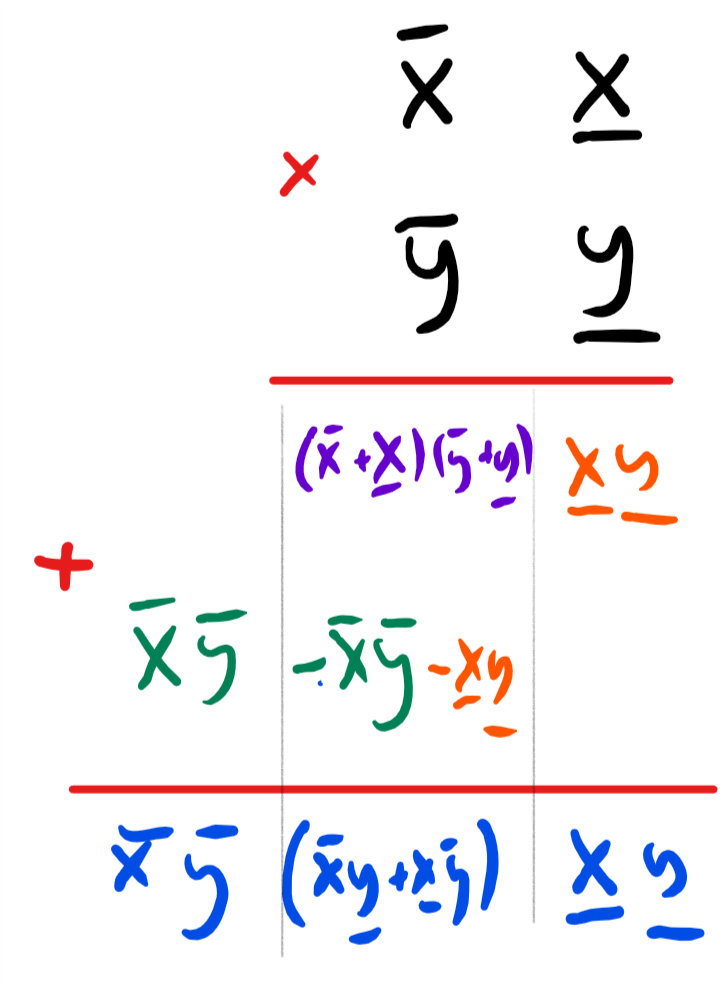

# 引言

> [!tip] 本章的学习目标
> * 介绍并激发对“计算”本身的研究兴趣，而不局限于具体的实现方式。
> * 了解*算法*（Algorithm）这一概念及其发展历程。
> * 算法不只是一种工具，更是一种思考和理解的方式。
> * 领略大O分析法（Big-$O$ analysis）和高效算法设计中蕴含的惊人创造力。

> [!quote] 
> “计算机科学并非仅与计算机有关，正如天文学并非仅于望远镜有关。”
> 
> *—Edsger Dijkstra*

> [!quote] 
> “黑客需要了解计算中的理论，正如画家需要了解颜料中的化学一样。”
> 
> *—Paul Graham，2003年*

> [!quote] 
> “我的演讲主题或许可以通过提出两个简单的问题来最直接地揭示：首先，乘法是否比加法更难？其次，为什么？…….我（想）证明，在计算上，没有跟加法一样简单的乘法算法，这证明了一些理论上的绊脚石的存在。”
> 
> *—Alan Cobham，1964年*

*位值数字系统*（place-value number system）古巴比伦人最大的发明之一。在位值数字系统中，数字（number）被表示为一串数位（digit）序列，其中每个数位的位置决定了其数值。

这与类似罗马数字的系统刚好相反，在罗马数字中，每个数位无论其在数字中的位置如何，均有一个不变的值。举个例子，地球到月球的平均距离大概是259956罗马英里。在标准罗马数字中，这个数字的表示为：

```
MMMMMMMMMMMMMMMMMMMMMMMMMMMMMM
MMMMMMMMMMMMMMMMMMMMMMMMMMMMMM
MMMMMMMMMMMMMMMMMMMMMMMMMMMMMM
MMMMMMMMMMMMMMMMMMMMMMMMMMMMMM
MMMMMMMMMMMMMMMMMMMMMMMMMMMMMM
MMMMMMMMMMMMMMMMMMMMMMMMMMMMMM
MMMMMMMMMMMMMMMMMMMMMMMMMMMMMM
MMMMMMMMMMMMMMMMMMMMMMMMMMMMMM
MMMMMMMMMMMMMMMMMMMDCCCCLVI
```

使用罗马数字表示地球到太阳的距离需要大概100000个符号，而我们需要一本50页的书来书写这一个数字！

对于那些习惯于像罗马数字那样以加法系统来思考数字的人来说，诸如地球到月球距离的这种数字不仅仅是大—它们无法形容：这些数字不能被有效地表达甚至是理解。这也难怪第一个计算地球直径的埃拉托色尼（计算误差约为10%），和第一个计算地球与月球之间距离的喜帕恰斯使用了古巴比伦的六十进制位值数字系统，而不是使用罗马数字系统。

## 0.1 整数的乘法：一个算法示例

在计算机科学的语言中，这种用于表示数字的位值系统是一种*数据结构*（data structure），数据结构是一组用于将对象表示为符号的指令或“配方”。而*算法*（algorithm）则是在此类表示形式上执行操作的一组指令或“配方”。数据结构与算法不仅催生了改变人类社会的惊人应用，其重要性更远超实用价值。比特（bit）、字符串（string）、图（graph），乃至程序本身等计算机科学体系中的数据结构，以及普适性、复制等概念，不仅被广泛应用于实践领域，更催生了一种全新的语言和审视世界的方式。

除了位值数字系统，古巴比伦人还发明了我们在小学中都学过的加法和乘法的“标准算法”。这些算法在漫长的历史中始终至关重要，无论是使用算盘、莎草纸还是纸笔计算的人们均受惠于此，但在计算机的时代，除了折磨小学三年级学生之外，这些算法是否还有存在的价值？为了说明这些算法为何至今仍具有重要意义，让我们将古巴比伦人的逐位相乘算法（即“小学乘法”）与通过重复相加实现的朴素乘法算法进行对比。我们首先正式描述这两种算法，详见算法0.1和算法0.2：

**算法0.1**：通过重复相加实现的乘法算法
$$
\begin{align}
&\textbf{输入：}\text{非负整数}x,y\\
&\textbf{输出：}\text{乘积}x\cdot y\\
&\text{Let }\texttt{result}\leftarrow 0\\
&\textbf{for }\{i=1,\ldots,y\}\\
&\quad\texttt{result}\leftarrow\texttt{result}+ x\\
&\textbf{endfor}\\
&\textbf{return }\texttt{result}\\
\end{align}
$$
**算法0.2：**“小学乘法”
$$
\begin{align}
&\textbf{输入：}\text{非负整数}x,y\\
&\textbf{输出：}\text{乘积}x\cdot y\\
&\text{将}x=x_{n-1}x_{n-2}\dots{x_0}与y=y_{m-1}y_{m-2}\dots y_0写做十进制数\\
&x_0\textit{是}x\textit{个位上的数，}x_1\textit{是}x\textit{十位上的数，依此类推。}\\
&\text{Let }\texttt{result}\leftarrow 0\\
&\textbf{for }\{i=1,\ldots,n-1\}\\
&\quad\textbf{for }\{j=1,\ldots,m-1\}\\
&\quad\quad\texttt{result}\leftarrow\texttt{result}+10^{i+j}\cdot x_i\cdot y_j\\
&\quad\textbf{endfor}\\
&\textbf{endfor}\\
&\textbf{return }\texttt{result}\\
\end{align}
$$


算法0.1和算法0.2均假定我们已经掌握了数字相加的方法，而算法0.2还假定我们能够将数字与10的幂相乘（毕竟这只相当于一次简单的移位）。假设$x$和$y$是两个$n=20$位的十进制整数（这大致相当于64位二进制数，也是许多编程语言中常见的类型）。使用算法0.1计算$x\cdot y$需要将$x$自身相加$y$次。由于$y$有20位，这意味着我们需要至少进行$10^{19}$次加法运算。相比之下，算法0.2仅需$n^2$次移位和单位数字的乘法运算，因此最多仅需$2n^2=800$次单位数字的操作。为了理解这种差异，假设一个小学生完成单位数字的操作需要2秒，那么使用算法0.2计算$x\cdot y$需要约1600秒（约半小时）。反之，即使现代计算机的运算速度比人类快十亿倍以上，若采用算法0.1进行计算，则需要$10^{20}/10^{9}=10^{11}$秒（超过3000年！）才能得到相同的结果。

计算机从未使算法过时。恰恰相反，随着人类测量、存储和传输数据的能力的大幅提升，我们比以往更需要开发精密而高效的算法，从而基于数据洪流做出更明智的决策。我们也不难发现：算法的概念在很大程度上独立于实际执行计算操作的设备。无论是硅基芯片还是借助纸笔计算的小学三年级学生，逐位相乘的算法都远胜于重复累加法。

理论计算机科学专注于研究算法和计算的内在属性—即那些独立于现有技术而存在的本质特征。我们既探讨古巴比伦人早已思索过的问题（比如“什么是两数相乘的最优方法”），也研究依赖前沿科技的课题（例如“能否利用量子纠缠效应实现更快速的因数分解”）。

> [!remark] 算法的规范、实现与分析
>
> 一个算法的完整描述包括三个部分：
>
> - **规范**（specification）：算法完成了什么任务，即**做了什么**（例如，算法0.1和算法0.2进行的乘法）。
> - **实现**（implementation）：如何完成算法的任务，即**如何做**。即使算法0.1与算法0.2完成的是同样的两数相乘的乘法，它们的实现方式并不相同（即两个算法具有不同的*实现*）。
> - **分析**（analysis）：**为什么**组成算法的这一系列指令能够完成它的任务。一个对于算法0.1和算法0.2的完整描述包含一个*证明*，证明这两个算法在接受到输入$x,y$的时候的确会输出两数的乘积$x\cdot y$。
>
> 一般来说，算法的分析不仅会包含对算法的**正确性**分析，还会包含对算法**高效性**的分析。也就是说，我们不仅想证明算法完成了预计的任务，而且会在规定的次数内完成。比如说，算法0.2使用了$O(n^2)$次操作完成了对$n$位数字的乘法，而算法0.4（在下一节中介绍）使用了$O(n^{1.6})$次操作完成了同样的操作（我们会在第1.4.8节中定义大$O$表示法）

## 0.2 扩展示例：一种更快的乘法方法（可选）

一旦你想到标准的逐位相乘乘法，它似乎是“显然最优”的数字相乘方式。1960年，著名数学家安德雷·柯尔莫哥洛夫（Andrey Kolmogorov）在莫斯科国立大学组织了一场研讨会，他在会上提出猜想：任何两个$n$位数相乘的算法都需要执行与$n^2$成正比的基本操作次数（用第一章定义的大$O$符号表示为$\Omega(n^2)$次操作）。换言之，柯尔莫哥洛夫认为在任何乘法算法中，相乘的数字位数翻倍会导致所需基本操作次数变为四倍。当时听众中有一位名叫阿纳托利·卡拉楚巴（Anatoly Karatsuba），他在一周内就推翻了柯尔莫哥洛夫的猜想—他发现了一种仅需$Cn^{1.6}$次操作（$C$为常数）的算法。随着$n$增大，这个数字会远小于$n^2$，因此对于大数而言，卡拉楚巴算法优于小学算法。（例如Python在处理1000比特及以上的数字时，会从小学算法切换至卡拉楚巴算法。）虽然$O(n^{1.6})$与$O(n^2)$算法之间的差异有时在实践中至关重要（参见下文的0.3节），但本书将基本忽略这类区别。不过我们仍会在下文介绍卡拉楚巴算法，因为它完美展现了算法往往出人意料的特性，同时也体现了算法分析的重要性—这正是本书乃至整个理论计算机科学的核心所在。

卡拉楚巴算法基于一种两位数字之间的更快的相乘算法。假设$x,y\in[100]=\{0,\ldots,99\}$是一对两位数字。我们使用$\overline x$表示$x$的十位上数字，$\underline x$表示个位上的数字，所以$x$可以表示为$x=10\overline x+\underline x$，$y$亦可写成$y=10\overline y+\underline y$，这里$\overline x,\underline x,\overline y,\underline y\in[10]$。图0.1展示了两位数字的小学乘法。

**图一**：两位数字的小学乘法


小学乘法的算法可以看作一个将两位数字相乘的任务转化为*四个*单位数字相乘的过程：

{{eq}}{eq:gradeschool}[方程1]
$$
(10\overline x+\underline x)\times(10\overline y+\underline y)=100\overline x\overline y+10(\overline x\underline y+\underline x+\overline y)+\underline x\underline y
$$
通常，在小学算法中，输入数字位数翻倍会导致操作次数变为原来的四倍，从而形成$O(n^2)$时间复杂度的算法。相比之下，卡拉楚巴算法基于这样一个观察：我们同样可以将{{ref: eq:gradeschool}}表示为：

{{eq}}{eq:karatsuba}[方程2]
$$
(10\overline{x}+\underline{x}) \times (10 \overline{y}+\underline{y}) = (100-10)\overline{x}\overline{y}+10\left[(\overline{x}+\underline{x})(\overline{y}+\underline{y})\right] -(10-1)\underline{x}\underline{y}
$$
这将两位数字$x,y$的乘法简化为了以下三个更简单的乘积计算：$\overline x\overline y$、$\underline x\underline y$以及$(\overline{x}+\underline{x})(\overline{y}+\underline{y})$。通过递归地重复相同策略，我们可以将两个$n$位数相乘的任务简化为三对$\floor{n/2}+1$位数相乘的任务。由于每当数字位数翻倍时，操作次数会变为三倍，因此当$n=2^l$时，我们可以使用约$3^l=n^{\log_23}\sim n^{1.585}$次操作完成乘法运算。

上述内容是卡拉楚巴算法背后的直观思想，但尚不足以完整描述该算法。一个算法的完整描述需要包含其操作步骤的精确说明以及算法分析：即证明该算法确实能实现预设任务。卡拉楚巴算法的具体操作步骤见算法0.4，其数学分析则包含在引理0.5和引理0.6中。

**图二**：两位数字乘法的卡拉楚巴算法



**图三**：卡拉楚巴算法与小学算法的运行时间对比


**算法0.4**：卡拉楚巴乘法算法
$$
\begin{align}
&\textbf{输入：}\text{非负整数}x,y\text{，每个数字最多有}n\text{位}\\
&\textbf{输出：}x\cdot y\\
&\textbf{Procedure }\mathsf{Karatsuba}(x,y)\\
&\quad\textbf{if }\{n\leq 4\}\textbf{ return }x\cdot y\\
&\quad\text{Let }m=\floor{n/2}\\
&\quad\text{将}x,y\text{分别写做}x=10^m\overline x+\underline x,y=10^m\overline y+\underline y\\
&\quad A\leftarrow\mathsf{Karatsuba}(\overline x,\overline y)\\
&\quad B\leftarrow\mathsf{Karatsuba}(\overline x+\underline x,\overline y+\underline y)\\
&\quad C\leftarrow\mathsf{Karatsuba}(\underline x,\underline y)\\
&\quad\textbf{return }(10^n-10^m)\cdot A+10^m\cdot B+(1-10^m)\cdot C\\
&\textbf{endproc}
\end{align}
$$


<iframe src="https://trinket.io/embed/python/9ddd61c11f" width="100%" height="600" frameborder="0" marginwidth="0" marginheight="0" allowfullscreen></iframe>

