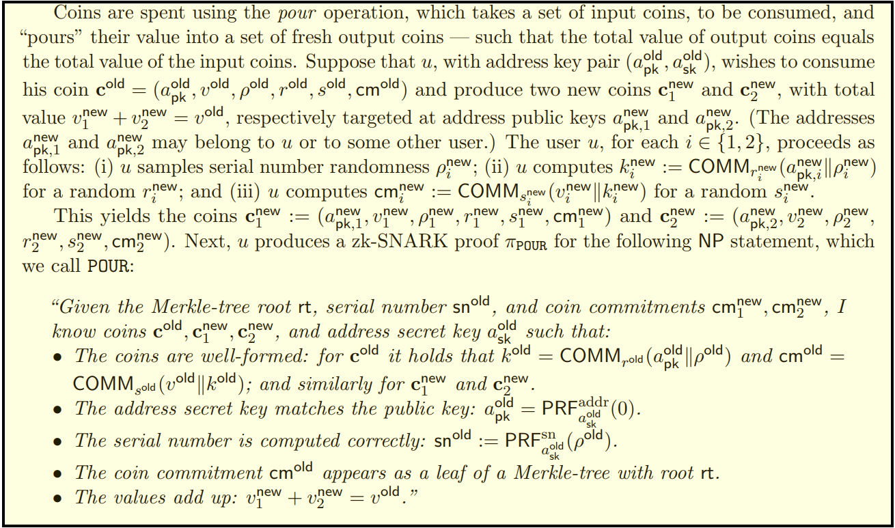

# 数学背景

> [!tip] 本章的学习目标
>
> - 学习基本的数学概念，如几何、函数、数字、逻辑运算符及量词、字符串和图。
> - 严格地定义大$O$表示法。
> - 归纳证明法。
> - 练习如何阅读数学*定义*、*陈述*与*证明*。
> - 将直观的论证转化为严谨的证明。

> [!quote] 
>
> “我发现，从一到十表达的每个数字，都比前一个数字多一个单位：之后，十的倍数会翻倍或增至三倍……直至一百；然后，一百的倍数会以与个位和十位相同的方式翻倍和增至三倍……以此类推，直至计数的最大极限。”，
>
> —*穆罕默德·伊本·穆萨·花拉子米（Muhammad ibn Mūsā al-Khwārizmī），820年，弗雷德里克·罗森（Fredric Rosen）译，1831年*

在本章中，我们将会介绍一些将在本书中用到的数学概念。这些概念一般会在“计算机科学中的数学”或“离散数学”等课程或课本中讲解。有关这些主题的几份可在线免费获取优秀资源，请参阅“参考书目”部分（[第1.9节](#19-参考书目)）。

*一个数学家的致歉*。部分学生可能会好奇为什么这本书包含如此多的数学，这是因为数学就是一门能够简洁而精确描述概念的语言。在这本书中，我们使用数学来描述*计算*的概念。比如说，我们将思考诸如“*是否存在一种高效算法来求取给定整数的质因数？*”这样的问题（我们将看到这个问题尤为有趣，它甚至触及了从互联网安全到量子力学等跨度极大的问题！）若要精准的描述这些问题，我们需要对*算法*这一概念以及算法的*高效性*给出精准的*定义*。此外，由于无法通过实验证明某种算法*不存在*，唯一能证实算法不存在性的方式就是*数学证明*。

## 1.1 本章：读者的参考手册

基于你已有的数学背景，你有两种阅读本章的方式：

- 如果你已经学习过”离散数学“、”计算机科学中的数学“或任何类似课程，则无需阅读整章内容，只需要快速地阅读[第1.2节](#12-前置数学知识的概览)来了解我们会用到什么数学工具与[第1.7节](#17-本书所用到的符号及规范)来了解本书所用符号，便可跳转至后续章节。或者，你也可以放松心情通读本章，既熟悉本书所用的符号体系，顺便品味（或忍受）笔者融于字里行间的哲学思考与幽默尝试。
- 若相关基础较为薄弱，可以参考[第1.9节](#19-参考书目)中提供的学习资源。本章虽然已经涵盖了所有所需知识点，但系统性地学习相关知识点可能对你更有帮助。数学学习重在实践，通过独立完成练习才能真正掌握这些内容。
- 建议你同时开始回顾离散概率论的相关知识，本书后续章节（见[第18章](/chapter_18.md)）将涉及这部分内容。

## 1.2 前置数学知识的概览

我们将使用的主要数学概念如下所示。此处仅列出这些概念，其具体定义将在本章后续部分给出。若您已熟悉所有这些内容，可以直接跳至[第1.7节](#17-本书所用到的符号及规范)查看我们使用的完整符号列表。

- **证明**：最重要的是，本书包含大量形式化数学推理，涵盖数学*定义*、*陈述*与*证明*。
- **集合及集合运算**：我们将广泛使用数学*集合*。涉及到的集合*关系*包括属于（$\in$）与包含（$\subseteq$），以及集合*运算*，主要是并集（$\cup$）、交集（$\cap$）与差集（$\setminus$）。
- **笛卡尔积（Cartesian product）与克林星号（Kleene star）运算**：两个集合$A$与$B$的*笛卡尔积*，记作$A\times B$（即由所有满足$a\in A$且$b\in B$的所有有序对$(a,b)$构成的集合），$A^n$表示$n$阶笛卡尔积（例如$A^3=A\times A\times A$），而$A^*$（称为*克林星号*）表示所有$n\in\{0,1,2,\dots\}$对应的$A^n$的并集。
- **函数**：函数的*定义域*和*陪域*，以及函数的性质（如*单射*函数和*满射*函数），还有*部分函数*（即不同于*全函数*的，对于定义域内部分元素可能存在未定义情况的函数）。
- **逻辑运算**：常用操作包括逻辑与（$\wedge$）、逻辑或（$\vee$）、逻辑非（$\neg$）等，以及存在量词（$\exists$）和全称量词（$\forall$）。
- **基础组合数学**：诸如$\binom{n}{k}$（表示大小为$n$的集合中所有$k$元子集的数量）等概念。
- **图论**：无向图和有向图、连通性、路径和环。
- **大$O$表示法**：使用$O,o,\Omega,\omega,\theta$符号分析函数的渐进增长性。
- **离散概率**：我们将使用概率论，特别是基于有限概率空间（如抛掷$n$枚硬币）的概率论，包括随机变量、期望和浓度等概念。概率论仅在本书后半部分使用，我们将在[第18章](/chapter_18.md)先行复习。然而概率推理是一项精妙（且极其实用）的技能，尽早开始掌握总是有益的。

本章后续部分将简要回顾上述概念。既是为了帮助读者重温可能已经生疏的知识，也是为了介绍我们的符号与约定——这些约定有时可能与你之前接触过的版本有所不同。

## 1.3 阅读数学文本

数学家使用各种专业术语的原因，与工程、法律、医学等其他众多领域并无差别：我们需要*精确*的术语，并为频繁使用的概念引入简洁表达。数学文本往往在单个句子中蕴含极高的信息密度，因此关键在于缓慢而仔细地阅读，逐个符号解析。

随着练习时间逐渐增长，你将发现阅读数学文本变得越来越轻松，且专业术语也不再是问题。更重要的是，数学文本阅读能力是从本书中能够获得的极具迁移价值的技能之一。我们的世界正飞速变化——这不仅体现在技术领域，更延伸至医学、经济学、法律乃至文化等人类实践的方方面面。无论你未来方向如何，都很可能会接触到包含前所未见新概念的文本（参见图1.1与图1.2中两个当代"热点领域"的例子）。掌握内化并应用新定义的能力至关重要。在数学课程相对安全稳定的学习环境中，这种技能更容易被掌握——至少你可以确信所有概念都有完整定义，并能随时向教学人员答疑解惑。

> **图1.1**：
>
> 
>
> *摘自Silver等人2017年发表于《自然》期刊的《[AlphaGo Zero](https://goo.gl/k8pVpL)》论文"方法"部分片段*

> **图1.2**：
>
> 
>
> *摘自Ben-Sasson等人奠定加密货币Zcash项目基础的《[Zerocash](http://zerocash-project.org/paper)》论文片段*

数学文本的基本构成要素有三：*定义*、*断言*与*证明*。

### 1.3.1 定义

数学家经常在已有的概念上定义新的概念。比如，以下是一个你可能曾经见过的数学定义（并且我们很快还会再见到）：

> [!note] {{def}}{def:one-to-one}[定义1.1：单射函数]
>
> 令$S$与$T$为集合。我们称一个函数$f:S\to T$是*单射*的（one-to-one或injective）当其对于任意两个元素$x,x'\in S$时，若$x\ne x'$，则有$f(x)\ne f(x')$。

{{tref:def:one-to-one}}阐述了一个简单的概念，但即便如此它也使用了大量符号。阅读此类定义时，一边阅读一边用笔进行标注往往很有帮助（见图1.3）。例如当看到诸如$f$、$S$或$x$等符号时，务必确认其指代的对象的类别：是集合、函数、元素、数字，还是小妖怪？你可能还会发现，向朋友（或对自己）用语言解释这一定义会很有帮助。

> **图1.3**：
>
> 
>
> *{{tref:def:one-to-one}}的注释版本，标出了定义的每个对象及其关联的定义*

### 1.3.2 断言：定理、引理、主张

定理、引理、断言等都是对已定义概念的真命题。将特定命题称为"定理"、"引理"还是"断言"属于主观判断，并不改变其数学实质——三者均指代已被证明为真的命题。区别在于：*定理*指代值得铭记和强调的重要结论；*引理*通常指技术性结论，其自身未必重要但能有效辅助其他定理的证明；*断言*则是为证明更重大结论而使用的"过渡性"命题，其自身价值并不受关注。

### 1.3.1 证明

数学*证明*是用以证实定理、引理及断言真实性的论证过程。我们将在下文[1.5节](#15-证明)讨论证明，其核心在于数学证明的标准极为严苛。与其他领域不同，数学证明必须是"无懈可击"的论证，确保证明对象无可置疑为真。本节涉及的数学证明示例参见习题解答1.1及[1.6节](#16-扩展示例：拓扑排序)。如前言所述，总体而言：理解**定义**比掌握**定理**更重要，理解**定理陈述**比掌握其**证明过程**更重要。

## 1.4 基础离散数学对象

在本节中，我们将快速回顾本书中所用的一些数学对象（你当然也可以把这些叫做数学中的“基本数据结构”）。

### 1.4.1 集合

一个*集合*是一些对象的无序容器。例如，$S=\{2,4,7\}$表示$S$指代一个包含数字$2$、$4$、$7$的集合（我们使用$2\in S$来表示$2$是$S$中的一个元素。）注意集合$\{2,4,7\}$与$\{7,4,2\}$是相同的，因为它们拥有相同的元素。同时，一个集合要么包含一个元素，要么不包含一个元素，不存在“包含两次”的概念，因此我们甚至可以将同一个集合$S$写作$\{2,2,4,7\}$（尽管这样写有些奇怪）。有限集合的*基数*（cardinality），即一个集合包含的元素的数量，记作$|S|$（基数亦可以定义在*无限*集上，见[第1.9节](#19-参考书目)的参考资料）。因此在上例中$|S|=3$。若集合$S$的元素都是集合$T$的元素，则称$S$为$T$的一个*子集*，记作$S\subseteq T$（我们亦可以称$T$为$S$的一个*超集*。）比如，$\{2,7\}\subseteq \{2,4,7\}$。不包含任何元素的集合称作*空集*，写作$\emptyset$。如果$A$是$B$的一个子集且$A$不等于$B$，则我们称$A$为$B$的一个*真子集*，记作$A\subsetneq B$。

我们可以通过将其元素全部列出来定义集合，也可以通过写下集合元素满足的一个条件来定义集合，例如：
$$
偶数集=\{x\;|\;对于某个非负整数y，有x=2y\}
$$
当然，同一集合有多种表示方式，我们常会使用直观的记号列出几个示例来说明规则。例如也可将$偶数集$定义为：
$$
偶数集=\{0,2,4,\ldots\}
$$
注意集合可以是有限的（如$\{2,4,7\}$）或无限的（如$\text{偶数集}$）。集合的元素不必是数字，例如英语元音的集合$\{a,e,i,o,u\}$，或按2010年人口普查的美国百万人口城市集合$\{\text{New York, Los Angeles, Chicago, Houston, Philadelphia, Phoenix, San Antonio, San Diego, Dallas}\}$。集合甚至可以包含其他集合作为元素，例如$\{1,2,3\}$所有偶数大小子集构成的集合$\{\emptyset,\{1,2\},\{2,3\},\{1,3\}\}$。

**集合运算**：集合$S$与的$T$的*并集*记作$S\cup T$，包含所有属于$S$或属于$T$的元素。*交集*记作$S\cap T$，包含同时属于$S$和$T$的元素。*差集*记作$S\setminus T$（部分文献中记作$S-T$），包含属于$S$但不属于$T$的元素。

**元组、列表、字符串、序列**：*元组*是有序的对象容器，例如$(1,5,2,1)$是包含四个元素的元组（称为$4$-元组或四元组）。由于元组是有序的，该元组不同于四元组$(1,1,5,2)$或三元组$(1,5,2)$。$2$-元组亦称为*有序对*。术语“*元组*”与“*列表*”可互换使用。若某个元组中的元素均来自于某个有限集$\Sigma$（如$\{0,1\}$），则称为*字符串*。类比集合，我们将元组$T$的*长度*记作$|T|$。与集合类似，元组亦有无限形式。例如由所有完全平方数组成的元组$(1,4,9,\ldots)$。无限的有序容器称为*序列*，有时亦称作“无限序列”以强调这一点。“有限序列”是元组的同义词。（可将集合$S$中元素的序列$(a_0,a_1,a_2,\dots)$视为函数$A:\N\to S$（其中对任意$n\in\N$满足$a_n=A(n)$）。类似地，可将$S$中元素的$k$-元组视为函数$A:[k]\to S$。）

**笛卡尔积**：若$S$与$T$是集合，则其*笛卡尔积*记作$S\times T$，是由所有满足$s\in S$且$t\in T$的有序对$(s,t)$构成的集合。例如，若$S=\{1,2,3\}$且$T=\{10,12\}$，则$S\times T$包含六个元素：$(1,10),(2,10),(3,10),(1,12),(2,12),(3,12)$。相似的，若$S,T,U$为集合，则$S\times T\times U$为由所有满足$s\in S$、$t\in T$、$u\in U$的三元组$(s,t,u)$构成的集合。更加一般地，对任意正整数$n$及集合$S_0,\dots,S_{n-1}$，用$S_0\times S_1\times\dots\times S_{n-1}$表示满足对每个$i\in\{0,\dots,n-1\}$有$s_i\in S_i$的有序$n$-元组$(s_0,\dots,s_{n-1})$的集合。对任意集合$S$，将$S\times S$记作$S^2$，$S\times S\times S$记作$S^3$，$S\times S\times S\times S$记作$S^4$，依此类推。

### 1.4.2 特殊集合

在本书中会反复用到数个特殊集合。集合
$$
\N=\{0,1,2,\ldots\}
$$

包含了所有的*自然数*，即非负整数。对于任意的自然数$n\in\N$，定义集合$[n]$为$\{0,\dots,n-1\}=\{k\in\N:k<n\}$（$\N$与$n$均从$0$开始计数，与此同时诸多文献中这两个集合是从$1$开始的计数的。从零开始计数只是一个约定俗成的做法，只要保持一致性，并不会产生太大差异。）

我们偶尔也会使用集合$\Z=\{\dots,-2,-1,0,1,2,\dots\}$来表示所有（负的和非负的）整数，同时使用$\R$来表示所有*实数*（这个集合不仅包含整数，同时也包含分数与无理数，例如，$\R$包含诸如$+0.5$、$-\pi$等的数字。）我们使用$\R_+$来表示所有*正*实数的集合$\{x\in\R:x>0\}$。这个集合有时亦写作$(0,\infty)$。

**字符串**：另外一个我们经常会用到的集合是
$$
\{0,1\}^n = \{ (x_0,\ldots,x_{n-1}) \;:\; x_0,\ldots,x_{n-1} \in \{0,1\} \}
$$
这个集合包含了所有长度为$n$（$n$为任意自然数）的二进制字符串。换句话说，$\{0,1\}^n$是包含所有由$0,1$组成的$n$-元组的集合。这与我们前文中的符号一致：$\{0,1\}^2$是笛卡尔积$\{0,1\}\times\{0,1\}$，$\{(0,1)\}^3$是笛卡尔积$\{(0,1)\}\times\{(0,1)\}\times\{(0,1)\}$，依此类推。

我们将字符串$(x_0,x_1,\dots,x_{n-1})$简单地写作$x_0x_1\cdots x_{n-1}$。例如，
$$
\{0,1\}^3=\{000,001,010,011,100,101,110,111\}
$$
对于所有字符串$x\in\{0,1\}^n$与$i\in[n]$，我们将$x$的第$i$个元素记作$x_i$。

我们也经常会使用包含所有长度二进制字符串的集合，即
$$
\{0,1\}^* = \{ (x_0,\ldots,x_{n-1}) \;:\; n\in\N \;,\;, x_0,\ldots,x_{n-1} \in \{0,1\} \}
$$
另一个表示这个集合的方式是
$$
\{0,1\}^* = \{0,1\}^0 \cup \{0,1\}^1 \cup \{0,1\}^2 \cup \cdots
$$
或者更为简洁的
$$
\{0,1\}^* = \bigcup_{n\in\N} \{0,1\}^n
$$
集合$\{0,1\}^*$包含了“长度为$0$的字符串”或“空字符串”，我们将这个字符串记作$\texttt{""}$（此处我们使用与大部分编程语言一致的符号，其他文献可能会使用$\epsilon$或$\lambda$来表示空字符串）。

**推广星号操作**：对于任意集合$\Sigma$，我们定义
$$
\Sigma^*=\bigcup_{n\in\N}\Sigma^n
$$
例如，若$\Sigma=\{a,b,c,d,\dots,z\}$，则$\Sigma^*$表示字母表a-z上所有有限长度字符串的集合。

**连接操作**：两个字符串$x\in\Sigma^n$与$y\in\Sigma^m$的连接是指将$y$书写在$x$后形成的$(n+m)$长度的字符串$xy$。具体而言，若$x\in\{0,1\}^n$且$y\in\{0,1\}^m$，则$xy$等于满足以下条件的字符串$z\in\{0,1\}^{n+m}$：当$i\in[n]$时$z_i=x_i$，当$i\in\{n,\dots,n+m-1\}$时$z_i=y_{i-n}$。

### 1.4.3 函数

若$S$与$T$为非空集合，则从$S$到$T$的*函数*（记作$F:S\to T$）会将每个元素$x\in S$关联到一个元素$F(x)\in T$。集合$S$称为函数$F$的*定义域*，集合$T$称为$F$的*陪域*。函数$F$的*像*是指集合$\{F(x)\;|\; x\in S\}$，即由所有被映射的输入元素对应的输出元素组成的$F$的陪域子集（有些文献使用“*值域*”一词表示函数的像，而另一些文献使用“*值域*”表示函数的陪域。因此我们将完全避免使用“值域”这一术语。）与集合类似，我们可以通过列出函数对$S$中所有元素给出的取值表或通过规则来定义函数。例如，若$S=\{0,1,2,3,4,5,6,7,8,9\}$且$T=\{0,1\}$，则下表定义了一个函数$F:S\to T$。注意该函数与规则$F(x)=(x\mod 2)$定义的函数相同。

> *函数的一个例子*
>
> | 输入 | 输出 |
> | ---- | ---- |
> | 0    | 0    |
> | 1    | 1    |
> | 2    | 0    |
> | 3    | 1    |
> | 4    | 0    |
> | 5    | 1    |
> | 6    | 0    |
> | 7    | 1    |
> | 8    | 0    |
> | 9    | 1    |

若$F:S\to T$满足对所有$x\ne y$均有$F(x)\ne F(y)$，则称$F$是*单射*（见{{tref:def:one-to-one}}，亦称为*单射函数*）。若$F$满足对每个$y\in T$均存在某个$x\in S$使得$F(x)=y$，则称$F$是*满射*（亦称作*满射函数*）。既是单射又是满射的函数称为*双射函数*或*双射*。从集合$S$到自身的双射亦称为$S$的*排列*。若$F:S\to T$是双射，则对于每个$y\in T$均存在唯一的$x\in S$使得$F(x)=y$。我们将该值$x$记作$F^{-1}(y)$。注意$F^{-1}(y)$本身也是从$T$到$S$的双射（你能明白为什么吗？）。

给出两个集合之间的双射通常是证明集合大小相同的有效方法。事实上，“$S$与$T$具有相同基数”的标准数学定义就是存在一个双射$f:S\to T$。此外，若存在从$S$到集合$\{0,\dots,n-1\}$的双射，则定义集合$S$的基数为$n$。正如我们将在本书后面看到的，这个定义可以推广到无限集合的基数定义。

**部分函数（又译偏函数）**：我们有时会关注从$S$到$T$的*部分函数*。部分函数允许在$S$的某个子集上未定义。也就是说，若$F$是从$S$到$T$的偏函数，则对每个$s\in S$，要么（如标准函数的情况）存在$T$中的元素$F(s)$，要么$F(s)$未定义。例如，部分函数$F(x)=\sqrt x$仅定义在非负实数上。当需要偏函数和标准（即非部分）函数时，我们称后者为*全函数*。当我们不加限定地说“函数”时，指的是全函数。

部分函数的概念是函数的严格推广，因此每个函数都是部分函数，但并非每个部分函数都是函数（也就是说，对于任意非空集合$S$与$T$，从$S$到$T$的偏函数集合是从$S$到$T$的全函数集合的真超集。）当需要强调从$A$到$B$的函数$f$可能不是全函数时，我们写作$f:A\to_p B$。我们也可以将从$S$到$T$的偏函数视为从$S$到$T\cup\{\bot\}$的全函数，其中$\bot$是一个特殊的“失败符号”。因此，我们可以说$F(x)=\bot$，而不是$F$在$x$处未定义。

**关于函数的基本事实**：验证能否证明以下结论是复习函数知识的绝佳方式：

- 若$F:S\to T$和$G:T\to U$是单射函数，则它们的复合函数$H:S\to U$（定义为$H(s)=G(F(s))$）也是单射。
- 若$F:S\to T$是单射，则存在一个满射函数$G:T\to S$，使得对于每个$s\in S$均有$G(F(s))=s$。
- 若$G:T\to S$是满射，则存在一个单射函数$F:S\to T$，使得对于每个$s\in S$均有$G(F(s))=s$。
- 若$S$与$T$是非空有限集合，则以下条件相互等价：(a) $|S|\le|T|$；(b) 存在单射函数$F:S\to T$；(c) 存在满射函数$G:T\to S$。这些等价关系实际上对无限集合$S$和$T$亦成立。对于无限集合，条件(b)（或等价的条件(c)）是$|S|\le|T|$的公认定义。

> **图1.4**：
>
> 
>
> *我们可以将有限函数表示为有向图，其中从$x$到$f(x)$有一条边。满射条件要求函数陪域中的每个顶点的入度至少为$1$。单射条件要求函数陪域中的每个顶点入度至多为$1$，上图的示例中，$F$是满射函数，$G$是单射函数，而$H$既不是满射也不是单射*

> [!tip] 暂停思考
>
> 你可以在许多离散数学教材中找到这些结论的证明，例如[Lehman-Leighton-Meyer讲义](https://cs121.boazbarak.org/LLM_data_types.pdf)中的第4.5节。但我强烈建议你尝试独立证明它们，或至少通过证明小规模情况（如$|S|=3,|T|=4,|U|=5$）的特殊实例来确信这些结论成立。

让我们以其中一个事实为例进行证明：

> {{lem}}{lem:lemma12}[引理1.2]
>
> 若$S,T$是非空集合且$F:S\to T$是单射，则存在满射函数$G:T\to S$，使得对每个$s\in S$均有$G(F(s))=s$。

*证明*：选择某个$s_0\in S$。我们将定义函数$G:T\to S$如下：对每个$t\in T$，若存在某个$s\in S$使得$F(s)=t$，则令$G(t)=s$（由于$F$的单射性质，不可能有两个不同的$s,s'$同时映射到$t$，因此$s$的选择是无歧义的）。否则，令$G(t)=s_0$。现在对于每个$s\in S$，根据$G$的定义，若$t=F(s)$，则$G(F(s))=s$。此外，这也表示$G$是满射，因为这意味着对每个$s\in S$都存在某个$t$（即$t=F(s)$）使得$G(t)=s$。

### 1.4.4 图

### 1.4.5 逻辑运算符与量词

### 1.4.6 求和与求积的量词

### 1.4.7 解析公式：绑定变量与自由变量

### 1.4.8 渐近分析与大$O$表示法

### 1.4.9 关于大$O$表示法的一些“经验法则”

## 1.5 证明

### 1.5.1 证明与程序

### 1.5.2 证明的书写风格

### 1.5.3 证明的方法

## 1.6 扩展示例：拓扑排序

### 1.6.1 数学归纳

### 1.6.2 通过归纳证明结论

### 1.6.3 最小性和唯一性

## 1.7 本书所用到的符号及规范

### 1.7.1 变量命名规范

### 1.7.2 一些数学习语

## 1.8 习题

## 1.9 参考书目

 