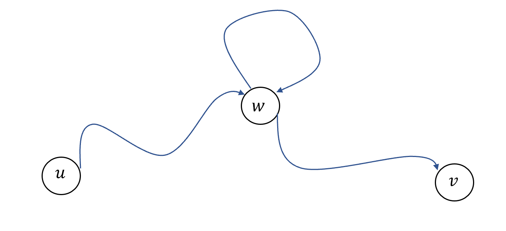
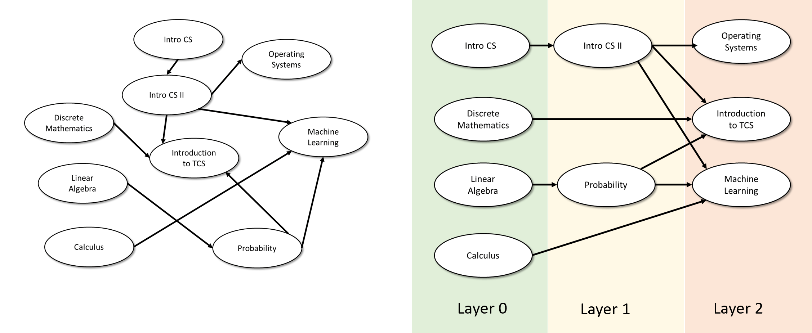
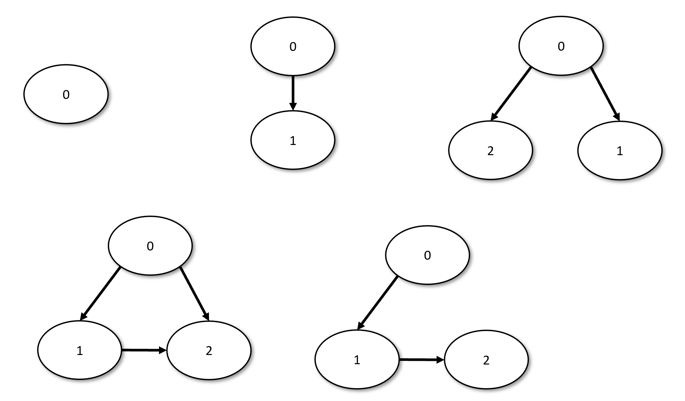

<!-- toc -->

# 数学背景

```admonish tip 
**本章的学习目标**：
- 学习基本的数学概念，如几何、函数、数字、逻辑运算符及量词、字符串和图。
- 严格地定义大$O$表示法。
- 归纳证明法。
- 练习如何阅读数学*定义*、*陈述*与*证明*。
- 将直观的论证转化为严谨的证明。
```

```admonish quote
“我发现，从一到十表达的每个数字，都比前一个数字多一个单位：之后，十的倍数会翻倍或增至三倍……直至一百；然后，一百的倍数会以与个位和十位相同的方式翻倍和增至三倍……以此类推，直至计数的最大极限。”，

—*穆罕默德·伊本·穆萨·花拉子米（Muhammad ibn Mūsā al-Khwārizmī），820年，弗雷德里克·罗森（Fredric Rosen）译，1831年*
```

在本章中，我们将会介绍一些将在本书中用到的数学概念。这些概念一般会在“计算机科学中的数学”或“离散数学”等课程或课本中讲解。有关这些主题的几份可在线免费获取优秀资源，请参阅“参考书目”部分（[第1.9节](#19-参考书目)）。

*一个数学家的辩白*。部分学生可能会好奇为什么这本书包含如此多的数学，这是因为数学就是一门能够简洁而精确描述概念的语言。在这本书中，我们使用数学来描述*计算*的概念。比如说，我们将思考诸如“*是否存在一种高效算法来求取给定整数的质因数？*”这样的问题（我们将看到这个问题尤为有趣，它甚至触及了从互联网安全到量子力学等跨度极大的问题！）若要精准的描述这些问题，我们需要对*算法*这一概念以及算法的*高效性*给出精准的*定义*。此外，由于无法通过实验证明某种算法*不存在*，唯一能证实算法不存在性的方式就是*数学证明*。


## 1.1 本章：读者的参考手册

基于你已有的数学背景，你有两种阅读本章的方式：

- 如果你已经学习过”离散数学“、”计算机科学中的数学“或任何类似课程，则无需阅读整章内容，只需要快速地阅读[第1.2节](#12-前置数学知识的概览)来了解我们会用到什么数学工具与[第1.7节](#17-本书所用到的符号及规范)来了解本书所用符号，便可跳转至后续章节。或者，你也可以放松心情通读本章，既熟悉本书所用的符号体系，顺便品味（或忍受）笔者融于字里行间的哲学思考与幽默尝试。
- 若相关基础较为薄弱，可以参考[第1.9节](#19-参考书目)中提供的学习资源。本章虽然已经涵盖了所有所需知识点，但系统性地学习相关知识点可能对你更有帮助。数学学习重在实践，通过独立完成练习才能真正掌握这些内容。
- 建议你同时开始回顾离散概率论的相关知识，本书后续章节（见[第18章](/chapter_18.md)）将涉及这部分内容。


## 1.2 前置数学知识的概览

我们将使用的主要数学概念如下所示。此处仅列出这些概念，其具体定义将在本章后续部分给出。若您已熟悉所有这些内容，可以直接跳至[第1.7节](#17-本书所用到的符号及规范)查看我们使用的完整符号列表。

- **证明**：最重要的是，本书包含大量形式化数学推理，涵盖数学*定义*、*陈述*与*证明*。
- **集合及集合运算**：我们将广泛使用数学*集合*。涉及到的集合*关系*包括属于（$\in$）与包含（$\subseteq$），以及集合*运算*，主要是并集（$\cup$）、交集（$\cap$）与差集（$\setminus$）。
- **笛卡尔积（Cartesian product）与克林星号（Kleene star）运算**：两个集合$A$与$B$的*笛卡尔积*，记作$A\times B$（即由所有满足$a\in A$且$b\in B$的所有有序对$(a,b)$构成的集合），$A^n$表示$n$阶笛卡尔积（例如$A^3=A\times A\times A$），而$A^*$（称为*克林星号*）表示所有$n\in\{0,1,2,\dots\}$对应的$A^n$的并集。
- **函数**：函数的*定义域*和*陪域*，以及函数的性质（如*单射*函数和*满射*函数），还有*部分函数*（即不同于*全函数*的，对于定义域内部分元素可能存在未定义情况的函数）。
- **逻辑运算**：常用操作包括逻辑与（$\wedge$）、逻辑或（$\vee$）、逻辑非（$\neg$）等，以及存在量词（$\exists$）和全称量词（$\forall$）。
- **基础组合数学**：诸如$\binom{n}{k}$（表示大小为$n$的集合中所有$k$元子集的数量）等概念。
- **图论**：无向图和有向图、连通性、路径和环。
- **大$O$表示法**：使用$O,o,\Omega,\omega,\theta$符号分析函数的渐进增长性。
- **离散概率**：我们将使用概率论，特别是基于有限概率空间（如抛掷$n$枚硬币）的概率论，包括随机变量、期望和浓度等概念。概率论仅在本书后半部分使用，我们将在[第18章](/chapter_18.md)先行复习。然而概率推理是一项精妙（且极其实用）的技能，尽早开始掌握总是有益的。

本章后续部分将简要回顾上述概念。既是为了帮助读者重温可能已经生疏的知识，也是为了介绍我们的符号与约定——这些约定有时可能与你之前接触过的版本有所不同。


## 1.3 阅读数学文本

数学家使用各种专业术语的原因，与工程、法律、医学等其他众多领域并无差别：我们需要*精确*的术语，并为频繁使用的概念引入简洁表达。数学文本往往在单个句子中蕴含极高的信息密度，因此关键在于缓慢而仔细地阅读，逐个符号解析。

随着练习时间逐渐增长，你将发现阅读数学文本变得越来越轻松，且专业术语也不再是问题。更重要的是，数学文本阅读能力是从本书中能够获得的极具迁移价值的技能之一。我们的世界正飞速变化——这不仅体现在技术领域，更延伸至医学、经济学、法律乃至文化等人类实践的方方面面。无论你未来方向如何，都很可能会接触到包含前所未见新概念的文本（参见[图1.1](#i11)与[图1.2](#i12)中两个当代"热点领域"的例子）。掌握内化并应用新定义的能力至关重要。在数学课程相对安全稳定的学习环境中，这种技能更容易被掌握——至少你可以确信所有概念都有完整定义，并能随时向教学人员答疑解惑。

> **图1.1**：
>
> 
>
> *摘自Silver等人2017年发表于《自然》期刊的《[AlphaGo Zero](https://goo.gl/k8pVpL)》论文"方法"部分片段*


> **图1.2**：
>
> 
>
> *摘自Ben-Sasson等人奠定加密货币Zcash项目基础的《[Zerocash](http://zerocash-project.org/paper)》论文片段*


数学文本的基本构成要素有三：*定义*、*断言*与*证明*。

### 1.3.1 定义

数学家经常在已有的概念上定义新的概念。比如，以下是一个你可能曾经见过的数学定义（并且我们很快还会再见到）：

> {{def}}{def:one-to-one}[定义1.1：单射函数]
>
> 令$S$与$T$为集合。我们称一个函数$f:S\to T$是*单射*的（one-to-one或injective）当其对于任意两个元素$x,x'\in S$时，若$x\ne x'$，则有$f(x)\ne f(x')$。

{{tref:def:one-to-one}}阐述了一个简单的概念，但即便如此它也使用了大量符号。阅读此类定义时，一边阅读一边用笔进行标注往往很有帮助（见[图1.3](#i13)）。例如当看到诸如$f$、$S$或$x$等符号时，务必确认其指代的对象的类别：是集合、函数、元素、数字，还是小妖怪？你可能还会发现，向朋友（或对自己）用语言解释这一定义会很有帮助。

> **图1.3**：
>
> 
>
> *{{tref:def:one-to-one}}的注释版本，标出了定义的每个对象及其关联的定义*


### 1.3.2 断言：定理、引理、主张

定理、引理、断言等都是对已定义概念的真命题。将特定命题称为"定理"、"引理"还是"断言"属于主观判断，并不改变其数学实质——三者均指代已被证明为真的命题。区别在于：*定理*指代值得铭记和强调的重要结论；*引理*通常指技术性结论，其自身未必重要但能有效辅助其他定理的证明；*断言*则是为证明更重大结论而使用的"过渡性"命题，其自身价值并不受关注。


### 1.3.1 证明

数学*证明*是用以证实定理、引理及断言真实性的论证过程。我们将在下文[1.5节](#15-证明)讨论证明，其核心在于数学证明的标准极为严苛。与其他领域不同，数学证明必须是"无懈可击"的论证，确保证明对象无可置疑为真。本节涉及的数学证明示例参见习题解答1.1及[1.6节](#16-扩展示例：拓扑排序)。如前言所述，总体而言：理解**定义**比掌握**定理**更重要，理解**定理陈述**比掌握其**证明过程**更重要。


## 1.4 基础离散数学对象

在本节中，我们将快速回顾本书中所用的一些数学对象（你当然也可以把这些叫做数学中的“基本数据结构”）。


### 1.4.1 集合

一个*集合*是一些对象的无序容器。例如，$S=\{2,4,7\}$表示$S$指代一个包含数字$2$、$4$、$7$的集合（我们使用$2\in S$来表示$2$是$S$中的一个元素。）注意集合$\{2,4,7\}$与$\{7,4,2\}$是相同的，因为它们拥有相同的元素。同时，一个集合要么包含一个元素，要么不包含一个元素，不存在“包含两次”的概念，因此我们甚至可以将同一个集合$S$写作$\{2,2,4,7\}$（尽管这样写有些奇怪）。有限集合的*基数*（cardinality），即一个集合包含的元素的数量，记作$|S|$（基数亦可以定义在*无限*集上，见[第1.9节](#19-参考书目)的参考资料）。因此在上例中$|S|=3$。若集合$S$的元素都是集合$T$的元素，则称$S$为$T$的一个*子集*，记作$S\subseteq T$（我们亦可以称$T$为$S$的一个*超集*。）比如，$\{2,7\}\subseteq \{2,4,7\}$。不包含任何元素的集合称作*空集*，写作$\emptyset$。如果$A$是$B$的一个子集且$A$不等于$B$，则我们称$A$为$B$的一个*真子集*，记作$A\subsetneq B$。

我们可以通过将其元素全部列出来定义集合，也可以通过写下集合元素满足的一个条件来定义集合，例如：
$$
偶数集=\{x\;|\;对于某个非负整数y，有x=2y\}
$$
当然，同一集合有多种表示方式，我们常会使用直观的记号列出几个示例来说明规则。例如也可将$偶数集$定义为：
$$
偶数集=\{0,2,4,\ldots\}
$$
注意集合可以是有限的（如$\{2,4,7\}$）或无限的（如$\text{偶数集}$）。集合的元素不必是数字，例如英语元音的集合$\{a,e,i,o,u\}$，或按2010年人口普查的美国百万人口城市集合$\{\text{New York, Los Angeles, Chicago, Houston, Philadelphia, Phoenix, San Antonio, San Diego, Dallas}\}$。集合甚至可以包含其他集合作为元素，例如$\{1,2,3\}$所有偶数大小子集构成的集合$\{\emptyset,\{1,2\},\{2,3\},\{1,3\}\}$。

**集合运算**：集合$S$与的$T$的*并集*记作$S\cup T$，包含所有属于$S$或属于$T$的元素。*交集*记作$S\cap T$，包含同时属于$S$和$T$的元素。*差集*记作$S\setminus T$（部分文献中记作$S-T$），包含属于$S$但不属于$T$的元素。

**元组、列表、字符串、序列**：*元组*是有序的对象容器，例如$(1,5,2,1)$是包含四个元素的元组（称为$4$-元组或四元组）。由于元组是有序的，该元组不同于四元组$(1,1,5,2)$或三元组$(1,5,2)$。$2$-元组亦称为*有序对*。术语“*元组*”与“*列表*”可互换使用。若某个元组中的元素均来自于某个有限集$\Sigma$（如$\{0,1\}$），则称为*字符串*。类比集合，我们将元组$T$的*长度*记作$|T|$。与集合类似，元组亦有无限形式。例如由所有完全平方数组成的元组$(1,4,9,\ldots)$。无限的有序容器称为*序列*，有时亦称作“无限序列”以强调这一点。“有限序列”是元组的同义词。（可将集合$S$中元素的序列$(a_0,a_1,a_2,\dots)$视为函数$A:\N\to S$（其中对任意$n\in\N$满足$a_n=A(n)$）。类似地，可将$S$中元素的$k$-元组视为函数$A:[k]\to S$。）

**笛卡尔积**：若$S$与$T$是集合，则其*笛卡尔积*记作$S\times T$，是由所有满足$s\in S$且$t\in T$的有序对$(s,t)$构成的集合。例如，若$S=\{1,2,3\}$且$T=\{10,12\}$，则$S\times T$包含六个元素：$(1,10),(2,10),(3,10),(1,12),(2,12),(3,12)$。相似的，若$S,T,U$为集合，则$S\times T\times U$为由所有满足$s\in S$、$t\in T$、$u\in U$的三元组$(s,t,u)$构成的集合。更加一般地，对任意正整数$n$及集合$S_0,\dots,S_{n-1}$，用$S_0\times S_1\times\dots\times S_{n-1}$表示满足对每个$i\in\{0,\dots,n-1\}$有$s_i\in S_i$的有序$n$-元组$(s_0,\dots,s_{n-1})$的集合。对任意集合$S$，将$S\times S$记作$S^2$，$S\times S\times S$记作$S^3$，$S\times S\times S\times S$记作$S^4$，依此类推。


### 1.4.2 特殊集合

在本书中会反复用到数个特殊集合。集合
$$
\N=\{0,1,2,\ldots\}
$$


包含了所有的*自然数*，即非负整数。对于任意的自然数$n\in\N$，定义集合$[n]$为$\{0,\dots,n-1\}=\{k\in\N:k<n\}$（$\N$与$n$均从$0$开始计数，与此同时诸多文献中这两个集合是从$1$开始的计数的。从零开始计数只是一个约定俗成的做法，只要保持一致性，并不会产生太大差异。）

我们偶尔也会使用集合$\Z=\{\dots,-2,-1,0,1,2,\dots\}$来表示所有（负的和非负的）整数，同时使用$\R$来表示所有*实数*（这个集合不仅包含整数，同时也包含分数与无理数，例如，$\R$包含诸如$+0.5$、$-\pi$等的数字。）我们使用$\R_+$来表示所有*正*实数的集合$\{x\in\R:x>0\}$。这个集合有时亦写作$(0,\infty)$。

**字符串**：另外一个我们经常会用到的集合是
$$
\{0,1\}^n = \{ (x_0,\ldots,x_{n-1}) \;:\; x_0,\ldots,x_{n-1} \in \{0,1\} \}
$$
这个集合包含了所有长度为$n$（$n$为任意自然数）的二进制字符串。换句话说，$\{0,1\}^n$是包含所有由$0,1$组成的$n$-元组的集合。这与我们前文中的符号一致：$\{0,1\}^2$是笛卡尔积$\{0,1\}\times\{0,1\}$，$\{(0,1)\}^3$是笛卡尔积$\{(0,1)\}\times\{(0,1)\}\times\{(0,1)\}$，依此类推。

我们将字符串$(x_0,x_1,\dots,x_{n-1})$简单地写作$x_0x_1\cdots x_{n-1}$。例如，
$$
\{0,1\}^3=\{000,001,010,011,100,101,110,111\}
$$
对于所有字符串$x\in\{0,1\}^n$与$i\in[n]$，我们将$x$的第$i$个元素记作$x_i$。

我们也经常会使用包含所有长度二进制字符串的集合，即
$$
\{0,1\}^* = \{ (x_0,\ldots,x_{n-1}) \;:\; n\in\N \;,\;, x_0,\ldots,x_{n-1} \in \{0,1\} \}
$$
另一个表示这个集合的方式是
$$
\{0,1\}^* = \{0,1\}^0 \cup \{0,1\}^1 \cup \{0,1\}^2 \cup \cdots
$$
或者更为简洁的
$$
\{0,1\}^* = \bigcup_{n\in\N} \{0,1\}^n
$$
集合$\{0,1\}^*$包含了“长度为$0$的字符串”或“空字符串”，我们将这个字符串记作$\texttt{""}$（此处我们使用与大部分编程语言一致的符号，其他文献可能会使用$\epsilon$或$\lambda$来表示空字符串）。

**推广星号操作**：对于任意集合$\Sigma$，我们定义
$$
\Sigma^*=\bigcup_{n\in\N}\Sigma^n
$$
例如，若$\Sigma=\{a,b,c,d,\dots,z\}$，则$\Sigma^*$表示字母表a-z上所有有限长度字符串的集合。

**连接操作**：两个字符串$x\in\Sigma^n$与$y\in\Sigma^m$的连接是指将$y$书写在$x$后形成的$(n+m)$长度的字符串$xy$。具体而言，若$x\in\{0,1\}^n$且$y\in\{0,1\}^m$，则$xy$等于满足以下条件的字符串$z\in\{0,1\}^{n+m}$：当$i\in[n]$时$z_i=x_i$，当$i\in\{n,\dots,n+m-1\}$时$z_i=y_{i-n}$。


### 1.4.3 函数

若$S$与$T$为非空集合，则从$S$到$T$的*函数*（记作$F:S\to T$）会将每个元素$x\in S$关联到一个元素$F(x)\in T$。集合$S$称为函数$F$的*定义域*，集合$T$称为$F$的*陪域*。函数$F$的*像*是指集合$\{F(x)\;|\; x\in S\}$，即由所有被映射的输入元素对应的输出元素组成的$F$的陪域子集（有些文献使用“*值域*”一词表示函数的像，而另一些文献使用“*值域*”表示函数的陪域。因此我们将完全避免使用“值域”这一术语。）与集合类似，我们可以通过列出函数对$S$中所有元素给出的取值表或通过规则来定义函数。例如，若$S=\{0,1,2,3,4,5,6,7,8,9\}$且$T=\{0,1\}$，则下表定义了一个函数$F:S\to T$。注意该函数与规则$F(x)=(x\mod 2)$定义的函数相同。

```admonish example
*函数的一个例子*

| 输入 | 输出 |
| ---- | ---- |
| 0    | 0    |
| 1    | 1    |
| 2    | 0    |
| 3    | 1    |
| 4    | 0    |
| 5    | 1    |
| 6    | 0    |
| 7    | 1    |
| 8    | 0    |
| 9    | 1    |
```

若$F:S\to T$满足对所有$x\ne y$均有$F(x)\ne F(y)$，则称$F$是*单射*（见{{tref:def:one-to-one}}，亦称为*单射函数*）。若$F$满足对每个$y\in T$均存在某个$x\in S$使得$F(x)=y$，则称$F$是*满射*（亦称作*满射函数*）。既是单射又是满射的函数称为*双射函数*或*双射*。从集合$S$到自身的双射亦称为$S$的*排列*。若$F:S\to T$是双射，则对于每个$y\in T$均存在唯一的$x\in S$使得$F(x)=y$。我们将该值$x$记作$F^{-1}(y)$。注意$F^{-1}(y)$本身也是从$T$到$S$的双射（你能明白为什么吗？）。

给出两个集合之间的双射通常是证明集合大小相同的有效方法。事实上，“$S$与$T$具有相同基数”的标准数学定义就是存在一个双射$f:S\to T$。此外，若存在从$S$到集合$\{0,\dots,n-1\}$的双射，则定义集合$S$的基数为$n$。正如我们将在本书后面看到的，这个定义可以推广到无限集合的基数定义。

**部分函数（又译偏函数）**：我们有时会关注从$S$到$T$的*部分函数*。部分函数允许在$S$的某个子集上未定义。也就是说，若$F$是从$S$到$T$的偏函数，则对每个$s\in S$，要么（如标准函数的情况）存在$T$中的元素$F(s)$，要么$F(s)$未定义。例如，部分函数$F(x)=\sqrt x$仅定义在非负实数上。当需要偏函数和标准（即非部分）函数时，我们称后者为*全函数*。当我们不加限定地说“函数”时，指的是全函数。

部分函数的概念是函数的严格推广，因此每个函数都是部分函数，但并非每个部分函数都是函数（也就是说，对于任意非空集合$S$与$T$，从$S$到$T$的偏函数集合是从$S$到$T$的全函数集合的真超集。）当需要强调从$A$到$B$的函数$f$可能不是全函数时，我们写作$f:A\to_p B$。我们也可以将从$S$到$T$的偏函数视为从$S$到$T\cup\{\bot\}$的全函数，其中$\bot$是一个特殊的“失败符号”。因此，我们可以说$F(x)=\bot$，而不是$F$在$x$处未定义。

**关于函数的基本事实**：验证能否证明以下结论是复习函数知识的绝佳方式：

- 若$F:S\to T$和$G:T\to U$是单射函数，则它们的复合函数$H:S\to U$（定义为$H(s)=G(F(s))$）也是单射。
- 若$F:S\to T$是单射，则存在一个满射函数$G:T\to S$，使得对于每个$s\in S$均有$G(F(s))=s$。
- 若$G:T\to S$是满射，则存在一个单射函数$F:S\to T$，使得对于每个$s\in S$均有$G(F(s))=s$。
- 若$S$与$T$是非空有限集合，则以下条件相互等价：(a) $|S|\le|T|$；(b) 存在单射函数$F:S\to T$；(c) 存在满射函数$G:T\to S$。这些等价关系实际上对无限集合$S$和$T$亦成立。对于无限集合，条件(b)（或等价的条件(c)）是$|S|\le|T|$的公认定义。

> **图1.4**：
>
> 
>
> *我们可以将有限函数表示为有向图，其中从$x$到$f(x)$有一条边。满射条件要求函数陪域中的每个顶点的入度至少为$1$。单射条件要求函数陪域中的每个顶点入度至多为$1$，上图的示例中，$F$是满射函数，$G$是单射函数，而$H$既不是满射也不是单射*

```admonish tip
**暂停思考**：

你可以在许多离散数学教材中找到这些结论的证明，例如[Lehman-Leighton-Meyer讲义](https://cs121.boazbarak.org/LLM_data_types.pdf)中的第4.5节。但我强烈建议你尝试独立证明它们，或至少通过证明小规模情况（如$|S|=3,|T|=4,|U|=5$）的特殊实例来确信这些结论成立。
```

让我们以其中一个事实为例进行证明：

> {{lem}}{lem:lemma12}[引理1.2]
>
> 若$S,T$是非空集合且$F:S\to T$是单射，则存在满射函数$G:T\to S$，使得对每个$s\in S$均有$G(F(s))=s$。

*证明*：选择某个$s_0\in S$。我们将定义函数$G:T\to S$如下：对每个$t\in T$，若存在某个$s\in S$使得$F(s)=t$，则令$G(t)=s$（由于$F$的单射性质，不可能有两个不同的$s,s'$同时映射到$t$，因此$s$的选择是无歧义的）。否则，令$G(t)=s_0$。现在对于每个$s\in S$，根据$G$的定义，若$t=F(s)$，则$G(F(s))=s$。此外，这也表示$G$是满射，因为这意味着对每个$s\in S$都存在某个$t$（即$t=F(s)$）使得$G(t)=s$。


### 1.4.4 图

*图*在计算机科学及众多其他领域中无处不在。图可以用于建模非常多的数据类型，包括但不限于社交网络、调度约束、道路网络、深度神经网络、基因相互作用、观测值之间的相关性。几种图的正式定义将在下面给出，但如果你没有在先前的课程中了解过图，我强烈建议你从[第1.9节](#19-参考书目)中的资料中详细了解它们。

图有两种基本类型：*无向图*与*有向图*。

> {{def}}{def:undgraph}[定义1.3：无向图]
>
> 一个*无向图*$G=(V,E)$由一个*顶点*集$S$与一个*边*集$E$组成。每条边都是一个$V$的大小为2的子集。我们称两个顶点$u,v\in V$为*相邻顶点*，若边$\{u,v\}$在$E$中。

基于这个定义，我们可以定义关于图与顶点的几个性质。我们将$u$的相邻节点的个数成为$u$的*度数*。图中的一条*路径*是一个元组$(u_0,\dots,u_k)\in V^{k+1}$（其中$k>0$），且满足对每个$i\in[k]$，$u_{i+1}$都是$u_i$的相邻节点。*简单路径*是指所有$u_i$均不重复的路径$(u_0,\dots,u_{k-1})$。*环*是指满足$u_0=u_k$的路径$(u_0,\dots,u_k)$。若两个顶点$u,v\in V$满足$u=v$或存在一条从$u_0=u$到$u_k=v$的路径，则称这两个顶点是*联通的*。当图中每对顶点都联通时，我们称该图是*连通图*。

下面是一些关于无向图的基本事实。我们将为它们给出一些非正式的论证，但完整证明作为练习留待读者自行完成（完整证明可以在[第1.9节](#19-参考书目)中的诸多资源中找到）。

> {{lem}}{lem:14}[引理1.4]
>
> 在任意的无向图$G=(V,E)$中，所有顶点的度数之和等于边数的两倍。

通过观察可知：每条边$\{u,v\}$会对度数总和贡献两次（一次作用于$u$，另一次作用于$v$），由此可证明{{tref:lem:14}}。

> {{lem}}{lem:15}[引理1.5]
>
> 连通关系具有传递性，即如果$u$与$v$相连，且$v$与$w$相连，则$u$与$w$也相连。

通过将路径$(u,u_1,u_2,\dots,u_{k-1},v)$与路径$(v,u_1',\dots,u_{k-1}',w)$拼接，得到连接$u$与$w$的路径$(u,u_1,\ldots,u_{k-1},v,u'_1,\ldots,u'_{k'-1},w)$，即可证明{{tref:lem:15}}。

> {{lem}}{lem:16}[引理1.6]
>
> 对于任意无向图$G=(V,E)$及连通顶点对$u,v$，从$u$到$v$的最短路径是简单路径。特别地，任意连通顶点对间均存在连接二者的简单路径。

通过“捷径修剪法”可证明{{tref:lem:16}}：若某路径中同一节点$w$出现两次，则移除其间的循环段（见[图1.6](#i16)）。将这一直观论证转化为形式化证明是很好的练习：

> **图1.6**：
>
> 
>
> *若图中存在从$u$到$v$的路径两次经过顶点$w$，则可移除$w$到自身的循环段，得到仅经过$w$一次的捷径路径。*

```admonish question
**已解答练习1.1**：

证明{{tref:lem:16}}。
```

```admonish success
**解答1.4.4**：

此证明遵循图1.6所示的思路。需要注意的复杂性在于：路径中可能有多个顶点被重复访问，因此“捷径修建”不一定能直接得到简单路径。我们通过考察$u$与$v$之间的*最短路径*来解决该问题。具体如下：

设$G=(V,E)$为无向图，$u$和$v$为$G$中两个连通顶点。我们将证明存在连接$u$和$v$的简单路径。令$k$为$u$与$v$之间路径的最短长度，并设$P=(u_0,u_1,u_2,\dots,u_{k-1},u_k)$为一条长度为$k$的路径（可能存在多条此类路径，若有则任选其一）。（即$u_0=u$，$u_k=v$，且对任意$l\in[k]$有$(u_l,u_{l+1})\in E$。）我们断言$P$是简单路径。假设存在某个顶点$w$在路径中出现两次：即对某些$i<j$有$w=u_i$且$w=u_j$。此时可通过取$P$的前$i$个顶点（从$u_0=u$到$w$的首次出现）和后$k-j$个顶点（从$w$第二次出现后的顶点$u_{j+1}$到$u_k=v$），得到捷径路径$P'=(u_0,u_1,\dots,u_{i-1},w,u_{j+1},\dots,u_k)$。由于$w=u_i=u_j$，$(u_{i-1},w)$和$(w,u_{j+1})$都是$E$中的边，因此$P'$是连接$u$和$v$的有效路径。但$P'$的长度为$k-(j-i)<k$，这与$P$的最小性矛盾。
```

```admonish info
{{rem}}{rem:17}[备注1.7：寻找证明的方法]

已解答练习1.1是寻找证明过程的典型示例。首先确保理解命题含义，随后提出非形式化论证说明其成立性，最后将非形式化论证转化为严格证明。该证明不必过长或过度形式化，但应清晰阐述为何从假设可推出结论。
```

度数和连通性的概念亦可自然推广至有向图，其定义如下：

> {{def}}{def:dirgraph}[定义1.8：有向图]
>
> 一个*有向图*$G=(V,E)$由顶点集$V$和边集$E\subseteq V\times V$（由$V$的有序对构成）组成。有时将边$(u,v)$记为$u\to v$。若存在边$u\to v$，则称$v$是$u$的*出邻居*，$u$是$v$的*入邻居*。

有向图可能同时包含边$u\to v$和$v\to u$，此时$u$和$v$互为入邻居和出邻居。顶点$u$的*入度*是其入邻居的数量，*出度*是其出邻居的数量。图中的*路径*是指元组$(u_0,\dots,u_k)\in V^{k+1}$（其中$k>0$），且对每个$i\in[k]$有$u_{i+1}$是$u_i$的出邻居。与无向图情形类似，*简单路径*是指所有$u_i$均不相同的路径$(u_0,\dots,u_{k-1})$，*环*是指满足$u_0=u_k$的路径$(u_0,\dots,u_k)$。我们经常关注的一类有向图是*有向无环图*（Directed Acyclic Graph，DAG），顾名思义即为不含环的有向图：

> {{def}}{def:dag}[定义1.9：有向无环图]
>
> 若有向图$G=(V,E)$中不存在顶点列$u_0,u_1,\dots,u_k\in V$使得$u_0=u_k$且对每个$i\in[k]$有边$u_i\to u_{i+1}\in E$，则称其为*有向无环图*（DAG）。

上述引理在有向图中均有对应版本。其证明（与无向图情形基本一致）将作为习题留给读者。

> {{lem}}{lem:110}[引理1.10]
>
> 对于任意有向图$G=(V,E)$，入度之和等于出度之和，且均等于边数。

> {{lem}}{lem:111}[引理1.11]
>
> 对于任意有向图，若存在从$u$到$v$的路径和从$v$到$w$的路径，则存在从$u$到$w$的路径。

> {{lem}}{lem:112}[引理1.12]
>
> 对于任意有向图$G=(V,E)$及存在路径的顶点对$u,v$，从$u$到$v$的最短路径是简单路径。

```admonish info
{{rem}}{rem:113}[备注1.13：带标签图]

在某些应用中，我们会考虑*带标签图*（其顶点或边关联有标签，标签可以是数字、字符串或其他集合中的元素）。此类图可视为具有（可能为部分的）标签函数$L:V\cup E\to\mathcal L$，其中$\cal L$为潜在标签集合。但我们通常不会显式引用此标签函数，而是直接表述为“顶点$v$具有标签$\alpha$等”。
```


### 1.4.5 逻辑运算符与量词

如果$P$和$Q$是可真可假的陈述，则$P$**与**$Q$（记为$P\wedge Q$）是一个当且仅当$P$和$Q$同时为真时才成立的陈述；而$P$**或**$Q$（记为$P\vee Q$）是一个当且仅当$P$或$Q$为真是成立的陈述。$P$的*否定*记作$\neg P$或$\overline P$，当且仅当$P$为假时该陈述为真。

假设$P(x)$是一个依赖于某个*参数*$x$（有时亦称为*自由变量*）的陈述，其特性在于：对于从集合$S$中取值的每一个$x$的具体赋值，$P(x)$都会有明确的真值。例如$x>7$这个陈述本身没有固有真值，但当我们用具体实数代入$x$时，它就会成为真或假的命题。我们用$\forall_{x\in S}P(x)$表示这样一个陈述：当且仅当对所有$s\in S$都有$P(x)$为真时，该陈述为真。用$\exists_{x\in S}P(x)$表示这样一个陈述：当且仅当存在某个$x\in S$使得$P(x)$为真时，该陈述为真。

例如下面这个形式化表达式，描述的是“存在大于100且不能被3整除的自然数$n$”这个真命题：
$$
\exists_{n\in \N} (n>100) \wedge \left(\forall_{k\in N} k+k+k \neq n\right)
$$
"对于足够大的$n$"。本书中会反复出现“某个陈述对于足够大的$n$成立”这样的论断，其含义是：存在整数$N_0$，使得对于所有$n>N_0$，$P(n)$都成立。我们可以将其形式化为$\exists_{N_0\in\N}\forall_{n>N_0}P(n)$。


### 1.4.6 求和与求积的量词

使用下列简记法来表示多个数的求和或求积往往更为便捷。若$S=\{s_0,\dots,s_{n-1}\}$是有限集且$f:S\to\R$是函数，则$\sum_{x\in S}f(x)$表示：
$$
f(s_0) + f(s_1) + f(s_2) + \ldots + f(s_{n-1})
$$
$\prod_{x\in S}f(x)$表示：
$$
f(s_0) \cdot f(s_1) \cdot f(s_2) \cdot \ldots \cdot f(s_{n-1})
$$
例如，从$1$到$100$的所有整数的平方和可表示为：

{{eq}}{eq:11}[公式1.1]
$$
\sum_{i\in \{1,\ldots,100\}} i^2
$$
由于对整数区间求和极为常见，对此存在特殊记号。对于任意两个满足$a\le b$的整数，$\sum^b_{i=a}f(i)$表示$\sum_{i\in S}f(i)$，其中$S=\{x\in\Z\;:\; a\le x\le b\}$。因此{{tref:eq:11}}可改写为：
$$
\sum^{100}_{i=1}i^2
$$


### 1.4.7 解析公式：约束变量与自由变量

在数学中，如同在编程中一样，我们常常会遇到符号化的“变量”或“参数”。给定某个公式时，理解特定变量在该公式中是约束变量还是自由变量至关重要。例如在如下陈述中，$n$是自由变量，而$a$和$b$是受存在量词$\exists$约束的变量：

{{eq}}{eq:12}[公式1.2]
$$
\exists_{a,b \in \N} (a \neq 1) \wedge (a \neq n) \wedge (n = a \times b)
$$
由于$n$是自由变量，它可以被赋予任意值，因此{{tref:eq:12}}的真值取决于$n$的取值。例如当$n=8$时公式成立，但当$n=11$时则不成立。（你能看出原因吗？）

同样的问题在解析代码时也会出现。例如在下列C语言代码片段中：

```c
for (int i=0 ; i<n ; i=i+1) {
    printf("*");
}
```

变量`i`在`for`循环块内是约束变量，而变量`n`则是自由变量。

约束变量的主要特性是：我们可以对其进行重命名（只要新名称不与其他变量名冲突）而不改变语句的含义。因此以下陈述

{{eq}}{eq:13}[公式1.3]
$$
\exists_{x,y \in \N} (x \neq 1) \wedge (x \neq n) \wedge (n = x \times y)
$$
与{{tref:eq:12}}完全等价—它们对$n$值的真值判断完全相同。

同样地，代码：

```c
for (int j=0 ; j<n ; j=j+1) {
    printf("*");
}
```

与使用`i`的代码段有完全相同的执行效果。

```admonish info
{{rem}}{rem:114}[备注1.14：数学符号与编程符号的对比]

数学符号与编程语言存在诸多相似性，这源于二者都是为精确传递复杂概念而构建的形式化体系。但两者存在文化差异：编程语言通常使用具有实际意义的变量名（如`NumberOfVertices`），而数学则倾向于使用简短标识符（如$n$）。部分原因可能源于数学证明的传统形式—手写论证与口头阐述，而非键入代码并编译执行。另一个原因是：在证明中使用错误变量名最多导致读者困惑，但在程序中使用错误变量名则可能导致飞机失事、患者死亡或火箭爆炸。

由此带来的结果是：数学中常常重复使用标识符，甚至会耗尽字母表而不得不引入希腊字母，并通过区分大小写及字体样式来扩展表示范围。同样地，数学符号体系大量使用"重载"机制——例如运算符$+$可对应多种不同对象（实数、矩阵、有限域元素等），其具体含义需通过上下文推断。

两个领域都存在"类型"概念。在数学中，我们通常约定特定字母表示特定类型的变量：例如$i,j,k,l,m,n$通常表示整数，$\epsilon$通常表示极小正实数（相关约定详见[1.7节](#17-本书所用到的符号及规范)）。阅读或撰写数学文本时，我们无法依赖"编译器"进行类型安全检查，因此必须密切关注每个变量的类型，确保所有操作都是"合法"的。

Kun的著作（[Kun, 2018](https://scholar.google.com/scholar?hl=en&q=Kun+A+programmer%27s+introduction+to+mathematics)）对数学与编程文化的异同进行了深入探讨。
```


### 1.4.8 渐近分析与大$O$表示法

```admonish quote

"$\log\log\log n$" 已被证明会趋近于无穷大，但从未被实际观测到这一现象。”

*——匿名，由卡尔·波默兰斯（Carl Pomerance）引用（2000年）*
```

精确描述运行时间等量通常非常繁琐，且并无必要，因为我们通常主要关注的是“高阶项”。也就是说，我们希望理解该量随输入变量增长时的缩放行为。例如，就运行时间而言，一个$n^5$时间算法与一个$n^2$时间算法之间的差异，远比$100n^2+10n$时间算法与$10n^2$算法之间的差异更加显著。为此，大$O$表示法作为一种“简化表述”的方式极为有用，它能让我们的注意力集中在真正重要的内容上。例如，使用大$O$表示法，我们可以说$100n^2+10n$和$10n^2$都简单的属于$\Theta(n^2)$（可非正式地理解为“在常数因子范围内相同”），而$n^2=o(n^5)$（可非正式地理解为$n^2$“远小于”$n^5$）。

通常（尽管为非正式表述），若$F,G$是两个将自然数映射到非负实数的函数，则“$F=O(G)$”表示在不考虑常数因子的情况下$F(n)\le G(n)$，而"$F=o(G)$"表示$F$远小于$G$，其含义是：无论给$F$乘以多大的常数因子，只要取足够大的$n$，$G$都会更大（因此，有时会将$F=o(G)$写作$F\ll G$）。如果$F=O(G)$且$G=O(F)$，则写作$F=\Theta(G)$，这可以理解为：若不考虑常数因子，$F$与$G$相同。更形式化地，我们如下定义大$O$表示法：

> {{def}}{def:115}[定义1.15：大$O$表示法]
>
> 设$R_+=\{x\in\R\;|\; x>0\}$为正实数集。对于两个函数$F,G:\N\to\R_+$，若存在$a,N_0\in\N$，使得对所有$n>N_0$有$F(n)\le a\cdot G(n)$，则称$F=O(G)$。若$F=O(G)$且$G=O(F)$，则称$F=\Theta(G)$。若$G=O(F)$，则称$F=\Omega(G)$。
>
> 若对任意$\epsilon>0$，存在$N_0$使得对所有$n>N_0$有$F(n)<\epsilon G(n)$，则称$F=o(G)$。若$G=o(F)$，则称$F=\omega(G)$。

> **图1.7**：
>
> 
>
> *若$F(n)=o(G(n))$，则当$n$足够大时，$F(n)$将小于$G(n)$。例如，若算法$A$的运行时间为$1000\cdot n+10^6$，算法$B$的运行时间为$0.01n^2$，那么即使$B$在小输入时更高效，当输入足够大时，$A$的运行速度将远快于$B$*

在大$O$表示法中使用“匿名函数”通常很方便。例如，当我们写$F(n)=O(n^3)$这样的语句时，我们的意思是$F=O(G)$，其中$G$是定义为$G(n)=n^3$的函数。[Jim Apsnes的离散数学笔记第七章](http://www.cs.yale.edu/homes/aspnes/classes/202/notes.pdf)很好地总结了大$O$表示法；另可参阅[本教程](http://discrete.gr/complexity/)，以获得更温和且更面向程序员的介绍。

*$O$并不表示相等*。在大$O$表示法中使用等号极为常见，但这种用法其实并不准确，因为诸如$F=O(G)$的语句实际上表示$F$属于集合$\{G':\exists_{N,c}使得\forall_{n>N}G'(n)\le cG(n)\}$。如果说有什么更合理的表示法，那就是使用不等式写作$F\le O(G)$和$F\ge\Omega(G)$，而将等号保留给$F=\Theta(G)$。因此，我们有时也会使用这种表示法，但由于使用等号的习惯已经根深蒂固，我们通常也沿用此习惯。（有些文献写作$F\in O(G)$而非$F=O(G)$，但我们不会使用这种表示法。）尽管等号可能引起误解，但请记住：诸如$F=O(G)$的语句表示在忽略常数的粗略意义上$F$“至多”为$G$，而诸如$F=\Omega(G)$的语句表示在相同粗略意义上$F$“至少”为$G$。


### 1.4.9 关于大$O$表示法的一些“经验法则”

在比较两个函数$F$和$G$时，有一些简单的经验法则可供参考：

- 在大$O$表示法中，乘性常数不影响结果。因此，若$F(n)=O(G(n))$，则$100F(n)=O(G(n))$。当两个函数相加时，我们只需要关注较大着。例如，在大$O$表示法的语句下，$n^3+100n^2$与$n^3$等价。一般而言，对于任意多项式，我们只需关注高阶项。
- 对于任意两个常数$a,b>0$，当且仅当$a\le b$时，$n^a=O(n^b)$成立，当且仅当$a<b$时，$n^a=o(n^b)$成立。例如，综合以上两点可知：$100n^2+10n+100=o(n^3)$。
- 多项式函数始终小于指数函数：对于任意两个常数$a>0$和$\epsilon>0$（即使$\epsilon$远小于$a$），都有$n^a=o(2^{n^\epsilon})$。例如，$100n^{100}=o(2^{\sqrt{n}})$。
- 类似地，对数函数始终小于多项式函数：对于任意两个常数$a,\epsilon>0$，$(\log n)^a$（记作$\log^a n$）满足$o(n^\epsilon)$。例如，综合上述观察可得：$100n^2\log^100 n=o(n^3)$。

```admonish info
{{rem}}{rem:119}[备注1.19：大$O$表示法的其他应用场景（可选）]

虽然大$O$表示法常用于分析算法的时间复杂度，但这绝非其唯一用途。我们可以用大$O$表示法来限定任意两个从整数映射到正数的函数之间的渐近关系。无论这些函数是衡量运行时间、内存使用量，还是其他与计算无关的量，该方法均适用。以下是一个与本书无关的例子（你可选择跳过）：[黎曼猜想](https://en.wikipedia.org/wiki/Riemann_hypothesis)（数学领域最著名的未解问题之一）的一种表述方式是：在$0$到$n$之间的质数数量等于$\int_2^n \tfrac{1}{\ln x} dx$，且其加性误差至多为$O(n\log⁡ n)$。
```


## 1.5 证明

许多人认为数学证明是从若干公理出发，通过逻辑推导最终得出结论的过程。事实上，某些词典也采用这种方式[定义证明](http://www.thefreedictionary.com/mathematical+proof)。这种理解并非完全错误，但从本质而言，对命题X的数学证明实质上是一个能让读者确信X为真且不容置疑的论证过程。

构建此类证明需要做到：

- 精确理解X的含义。
- 使*自己*确信X为真。
- 用清晰、准确、简洁的书面英语记录推理过程（仅在有助于明确性时使用公式或符号）。

多数情况下，第一步最为关键。理解命题含义往往比理解其真理性更耗费心力。在第三步中，为使读者毫无疑虑，我们常需将推理分解为若干"基本步骤"，其中每个步骤都应简单到"不言自明"的程度——所有步骤的叠加最终导出目标命题。


### 1.5.1 证明与程序

*证明写作*与*程序编写*具有高度相似性，且二者所需的技能也高度重合。*程序*编写包含：

- 理解程序需要实现的*功能*。
- 确信该*功能*可通过计算机实现（可通过在白板或记事本上规划如何拆解为子任务来实现）。
- 将规划转化为编译器或解释器可读的代码（通过将每个任务拆解为某种编程语言的基本操作序列）。

*与证明过程类似，程序设计的第一步往往最为关键。核心区别在于：证明的阅读者是人类，而程序的阅读者是计算机（随着机器*可验证*证明形式的普及，这种差异正在逐渐消弭；此外，为确保程序的正确性与可维护性，人类可读性至关重要）。因此我们特别强调证明的逻辑流畅性*与*可读性*（这对程序编写同样重要）。撰写证明时，应假想读者是聪明但极度多疑且挑剔的，他们会对任何未充分论证的步骤提出质疑。


### 1.5.2 证明的书写风格

数学证明是一种特定类型的写作形式，具有独特的惯例与偏好风格。如同所有写作类型，熟能生巧，且通过修改草稿提升清晰度至关重要。

在命题$X$的证明中，"**证明：**"与"**证毕**"之间的所有文字都应专注于论证$X$的真实性。题外话、示例或沉思应置于这两个标记之外，以免造成读者困惑。证明应具备清晰的逻辑流：每个句子或公式都应有明确目的，且读者能清晰理解其作用。撰写证明时，应对每个句子或公式进行审视：

1. 该句子/公式是否在声明某个命题为真？
2. 若是，该命题是从前述步骤推导而来，还是将在后续步骤中建立？
3. 这个句子/公式*起什么作用*？是通向原命题证明的一步，还是为证明先前所述的中间论断而设？
4. 最后，读者是否能清晰理解前三个问题的答案？若否，则需要调整顺序、重新表述或补充说明。

关于数学写作的推荐资源包括[Lee的讲义](https://sites.math.washington.edu/~lee/Writing/writing-proofs.pdf)、[Hutching的讲义](https://math.berkeley.edu/~hutching/teach/proofs.pdf)，以及[斯坦福大学CS103课程](http://web.stanford.edu/class/cs103/)中的若干优秀讲义。


### 1.5.3 证明的方法

```admonish quote

“假如事情是这样，那就有可能；假如事情是这样，那就会是；但既然事情不是这样，那就不是。这就是逻辑。”

*——刘易斯·卡罗尔（Lewis Carroll）《爱丽丝镜中奇遇记》*
```

正如编程一样，证明亦有数种常用的方法。以下是一些例子：

**反证法**：证明$X$的一种方式是展示，若$X$为假，则会导致导出矛盾。这种类型的证明通常由一句“假设，为了得出矛盾，$X$为假”作为开头，并以推导出一个矛盾作为结尾（如违反定理陈述中的某个假设）。以下是一个例子：

> {{lem}}{lem:pbc}[引理]
>
> 不存在自然数$a,b$使得$\sqrt{2}=\tfrac{a}{b}$。

*证明*：假设，为了得出矛盾，上述引理为假。令$a\in\N$为满足$\sqrt{2}=\tfrac{a}{b}$的最小自然数（其中$b\in\N$）。对此等式两侧平方有$2=a^2/b^2$，即$a^2=2b^2$ $(*)$。此式表明$a^2$为*偶数*。由于两个奇数之积亦为奇数，这表明$a$必须是偶数，即存在$a'\in\N$使得$a=2a'$。将此式代入$(*)$有$4a'^2=2b^2$，即$b^2=2a'^2$，且这表明$b^2$亦为为偶数。与$a$类似，我们亦可得到$b$为偶数。因此，$a/2$与$b/2$为两个满足$\tfrac{a/2}{b/2}=\sqrt{2}$的自然数，这与$a$的最小性相矛盾。

**全称命题的证明**：我们经常需要证明形如“所有类型为$O$的对象都具有性质$P$”的命题$X$。这类证明通常以“设$o$为类型$O$的一个对象”开始，并通过证明$o$具有性质$P$来结束，以下是一个简单的例子：

> {{lem}}{lem:pus}[引理]
>
> 对于任意自然数$n\in\N$，$n$和$n+1$中必有一个是偶数。

*证明*：设$n\in\N$为任意自然数。若$n/2$为整数，则$n=2(n/2)$，因此$n$是偶数，证毕。否则，$n/2+1/2$是整数，因此$2(n/2+1/2)=n+1$是偶数。

**蕴含命题的证明**：另一种常见情况是命题$X$形如“$A$蕴含$B$”。这类证明通常以"假设$A$成立"开始，并通过从$A$导出$B$来结束。以下是一个简单的例子：

> {{lem}}{lem:pis}[引理]
>
> 如果$b^2\ge4ac$，则二次方程$ax^2+bx+c=0$有解。

*证明*：假设$b^2\ge4ac$。则$d=b^2-4ac$是一个非负数，因此存在平方根$s$。于是$x=(-b+s)/(2a)$满足：

{{eq}}{eq:14}[公式1.4]
$$
\begin{aligned} ax^2 + bx + c &= a(-b+s)^2/(4a^2) + b(-b+s)/(2a) + c \\ &= (b^2-2bs+s^2)/(4a)+(-b^2+bs)/(2a)+c\end{aligned}
$$
整理{{tref:eq:14}}，我们得到：
$$
s^2/(4a)+c- b^2/(4a) = (b^2-4ac)/(4a) + c - b^2/(4a) = 0 
$$
**等价命题的证明**：如果命题形如“$A$当且仅当$B$”（通常简写为“$A$ iff $B$”），那么我们需要同时证明$A$蕴含$B$和$B$蕴含$A$。我们将$A$蕴含$B$的方向称为“仅当”方向，将$B$蕴含$A$的方向称为“当”方向。

**通过中间结论组合的证明**：当证明较为复杂时，将其分解为多个步骤通常是有帮助的。也就是说，为了证明命题$X$，我们可能先证明命题$X_1$、$X_2$和$X_3$，然后证明$X_1\wedge X_2\wedge X_3$蕴含$X$。（注：$\wedge$表示逻辑与运算符。）

**分情况证明**：这是上述方法的一种特殊形式，即为了证明命题$X$，我们将其分为若干情况$C_1,\dots,C_k$，并证明：(a) 这些情况是穷尽的，即其中一种情况$C_i$必须发生；(b) 逐一证明每种情况$Ci$都能推导出我们想要的结果$X$。

**数学归纳法证明**：我们将在下面的[第1.6.1节](#161-数学归纳)中讨论数学归纳法并给出示例。我们可以将这类证明视为上述方法的变体，其中我们有无穷多个中间结论$X_0,X_1,X_2,\dots,X_k$，并证明$X_0$成立，且$X_0$蕴含$X_1$，$X_0\wedge X_1$蕴含$X_2$，依此类推。卡内基梅隆大学15-251课程的网站提供了一份[有用的讲义](http://www.cs.cmu.edu/~arielpro/15251f17/notes/induction-pitfalls.pdf)，介绍了使用数学归纳法时可能遇到的常见陷阱。

**“不失一般性”（without loss of generality，w.l.o.g）**：这个术语最初可能令人困惑。它本质上是一种通过简化情况分析来简化证明的方法。其思想是，如果情况1和情况2在变量替换或类似变换下是相同的，那么情况1的证明也隐含了情况2的证明。但对此应始终保持怀疑态度。每当在证明中看到它时，问问自己是否理解为什么所做的假设是真正“不失一般性”的；而当使用它时，尝试确认这种使用是否确实合理。在撰写证明时，有时最简单的方法是直接重复第二种情况的证明（并添加注释说明该证明与第一种情况非常相似）。

```admonish info
{{rem}}{rem:120}[备注1.20：分层证明（可选）]

数学证明最终是用英文散文写的。知名计算机科学家[Leslie Lamport](https://en.wikipedia.org/wiki/Leslie_Lamport)认为这是一个问题，证明应该以更形式化和严谨的方式书写。他在[手稿](https://lamport.azurewebsites.net/pubs/proof.pdf)中提出了一种结构化分层证明的方法，其形式如下：

- 对于形如“如果$A$则$B$”的命题，其证明是一系列编号的声明，以假设$A$成立开始，并以声明$B$成立结束。
- 每个声明后面都附有一个证明，展示它如何从先前的假设或声明推导出来。
- 每个声明的证明本身又是一系列子声明。

Lamport格式的优点在于，证明中每个句子的作用非常清晰。此外，这种证明也更容易转换为机器可检查的形式。缺点在于，这类证明可能读起来和写起来都很繁琐，且论证的重要部分与常规部分之间的区分不够明显。
```


## 1.6 扩展示例：拓扑排序 {#topsortsec}

在本节中，我们将证明如下结论：每个有向无环图（DAG，参见{{tref:def:dag}}）都可以进行分层排列，使得对于所有有向边$u\to v$，顶点$v$所在的层都大于$v$所在的层。这一结论被称为[拓扑排序](https://goo.gl/QUskBc)，被广泛应用于任务调度、构建系统、软件包管理、电子表格单元格计算等场景（见[图1.8](#i18)）。事实上，在本书后续内容中我们也会用到这一结论。

> **图1.8**：
>
> 
>
> *拓扑排序示例。我们考虑某个计算机科学专业课程先修关系对应的有向图，其中边$u\to v$表示课程$u$是课程$v$的先修课程。对该图进行分层或"拓扑排序"等价于将课程映射到不同学期，使得若我们计划在学期$f(v)$修读课程$v$，则已在此前的学期修完$v$的所有先修课程（即其入邻居）*

我们首先给出如下定义。有向图的分层是指为每个顶点$v$分配一个自然数（对应其所在层）的方法，要求$v$的入邻居处在更低编号的层，而出邻居处于更高编号的层。形式化定义如下：

> {{def}}{def:daglayer}[定义1.21：DAG的分层]
>
> 设$G=(V,E)$为有向图，$G$的*分层*是一个函数$f:V\to\N$，使得对于$G$的每条边$u\to v$，都有$f(u)<f(v)$。

本节将证明：有向图是无环的当且仅当其存在有效分层。

> {{thm}}{thm:toposort}[定义1.22：拓扑排序]
>
> 设$G$为有向图，则$G$是无环的当且仅当存在$G$的分层函数$f$。

要证明此类定理，首先需要理解其含义。由于这是一个“当且仅当”类型的陈述，{{tref:thm:toposort}}对应两个命题：

> {{lem}}{lem:123}[引理1.23]
>
> 对于任意有向图$G$，若$G$无环，则存在对应的分层。

> {{lem}}{lem:124}[引理1.24]
>
> 对于任意有向图$G$，若其存在分层，则$G$无环。

要证明{{tref:thm:toposort}}，则需同时证明{{tref:lem:123}}和{{tref:lem:124}}。引理{{tref:lem:124}}的证明实际上并不困难：直观上，若$G$包含环，则环上所有边的层数不可能全程递增—因为沿着环行进时必然会回到起点。形式化证明如下：

*证明*：设$G=(V,E)$为有向图，$f:V\to\N$是符合{{tref:def:daglayer}}的分层函数。用反证法假设$G$不是无环图，即存在环$u_0,u_1,\dots,u_k$满足$u_0=u_k$，且对每个$i\in[k]$都有边$u_i\to u_{i+1}$属于$G$。由于$f$是分层函数，对每个$i\in[k]$有$f(u_i)<f(u_{i+1})$，这意味着：
$$
f(u_0)<f(u_1)<\dots<f(u_k)
$$
但这与$u_0=u_k$导出的$f(u_0)=f(u_k)$相矛盾。

{{tref:lem:123}}对应着更复杂（但更有用）的方向。要证明它，需要说明如何为任意有向无环图$G$构造分层，使得所有边“指向上层”。

```admonish tip
**暂停思考**：

若未曾见过该定理的证明（或者已经遗忘），此时建议暂停阅读并尝试自行证明。一种思路是描述算法：输入为具有$n$个顶点和不超过$n-2$条边的有向无环图$G$，输出长度为$n$的数组$F$，使得对于图中每条边$u\to v$都有$F[u]<F[v]$。
```


### 1.6.1 数学归纳

证明{{tref:lem:123}}存在多种方法。一种做法是：首先针对小型图（如具有1、2或3个顶点的图，参见[图1.9](#i19)）进行证明——这类有限情形可通过穷举法验证，随后尝试将证明推广至更大规模的图。这种证明方法的技术术语称为*归纳证明*。

> **图1.9**：
>
> 
>
> *具有一、二、三个顶点的有向无环图示例及顶点分层标注的有效方式*

归纳法本质上是显而易见的["肯定前件"逻辑规则](https://en.wikipedia.org/wiki/Modus_ponens)（Modus Ponens）的应用，该规则指出：若(a) 命题$P$为真，且(b) $P$蕴含$Q$，则$Q$为真。

在归纳证明的框架中，我们通常有一个由整数$k$参数化的命题$Q(k)$，并通过证明以下两点来完成：(a) $Q(0)$为真；(b) 对任意$k>0$，若$Q(0),\dots,Q(k-1)$均为真，则$Q(k)$为真（尽管证明(b)通常是难点，但也存在需要巧妙处理"基础情形"(a)的案例）。通过运用肯定前件规则，我们可以从(a)和(b)推导出$Q(1)$为真。继而基于$Q(0)$与$Q(1)$为真的事实，结合(b)再次运用肯定前件规则可推出$Q(2)$为真。如此循环往复，可证得对所有$k$均有$Q(k)$为真。其中(a)称为"基础情形"，(b)称为"归纳步骤"，(b)中假设$Q(i)$对$i<k$成立的条件称为"归纳假设"（此处描述的归纳形式有时被称为"强归纳法"，以区别于"弱归纳法"——后者将(b)替换为"若$Q(k-1)$为真则$Q(k)$为真"；弱归纳法可视为强归纳法的特例，即不要求使用$Q(0),\dots,Q(k-2)$为真的条件）。

```admonish info
{{rem}}{rem:125}[备注1.25：归纳和递归]

归纳证明与递归算法密切相关。两者都是通过将大规模问题转化为较小规模的同类实例来求解。在解决输入规模为$k$的问题$P$时，递归算法会预设"若已获得解决规模小于$k$的$P$问题实例的方法"；而在证明参数为$k$的命题$Q$时，归纳法会思考"若已知对任意$k'<k$均有$Q(k')$为真"。

归纳与递归都是本课程及计算机科学领域（甚至数学与其他科学领域）的核心概念。初学者可能会感到困惑，但随着实践积累将会逐渐理解。若需进一步了解归纳证明与递归，可参考[斯坦福大学CS103课程讲义](https://cs121.boazbarak.org/StanfordCS103Induction.pdf)、[MIT 6.00课程讲座](https://ocw.mit.edu/courses/electrical-engineering-and-computer-science/6-00sc-introduction-to-computer-science-and-programming-spring-2011/unit-1/lecture-6-recursion/)或[Lehman-Leighton专著节选](https://cs121.boazbarak.org/LL_induction.pdf)。
```


### 1.6.2 通过归纳证明结论

通过归纳法证明{{tref:lem:123}}有多种方式。我们将基于顶点数量$n$进行归纳，因此定义命题$Q(n)$如下：

> $Q(n)$表示："对于每个具有$n$个顶点的有向无环图$G=(V,E)$，都存在对$G$的分层赋值。"

当$n=0$（即图不含顶点）时命题显然成立。因此只需证明：对于每个$n>0$，若$Q(n−1)$成立则$Q(n)$成立。

为此，我们需要找到一种方法：给定具有$n$个顶点的图$G$，将寻找$G$分层的问题转化为寻找具有$n−1$个顶点的其他图$G′$的分层问题。核心思路是找到$G$的一个*源点*（即没有入边的顶点$v$）。随后将顶点$v$分配至0层，并依据归纳假设将剩余顶点分配至$1,2,\dots$等层。

以上是{{tref:lem:123}}证明的直观思路。但在撰写正式证明时，我们将基于后见之明进行优化，将原本曲折的推理过程转化为从"证明："开始到"证毕（QED{{footnote: QED即拉丁文quod erat demonstrandum”，意为“这被证明了”}}）"（或符号$\blacksquare$）结束的线性化逻辑流。讨论、示例和旁注虽颇具启发性，但应该置于这两个标记界定的空间之外——正如优秀的指南所述，此空间内"每个句子都必须承担论证功能"。如同编程，我们可以将证明分解为小型"子程序"或"函数"（数学中称为*引理*或*断言*），即通过辅助性小命题来证明主要结论。但证明结构必须确保读者能清晰把握论证阶段，理解每个句子的作用及所属部分。现正式证明{{tref:lem:123}}。

*证明*：设$G=(V,E)$为有向无环图，$n=|V|$为其顶点数。采用对$n$归纳法证明。基础情形$n=0$时命题显然成立。当$n>0$时，归纳假设为：所有顶点数不超过$n−1$的有向无环图$G′$均存在分层。

首先建立如下断言：

**断言**：图$G$必存在入度为零的顶点$v$。

**断言证明**：假设反之，即每个顶点$v\in V$都有入邻居。任取顶点$v_0$，令$v_1$为$v_0$的入邻点，$v_2$为$v_1$的入邻点，依此重复$n$步构造序列$v_0,v_1,\dots,v_n$，其中每个$i\in[n]$都有$v_{i+1}$是$v_i$的入邻点（即存在边$v_{i+1}\to v_i$）。由于图仅含$n$个顶点，该序列的$n+1$个顶点中必存在重复，即存在$i<j$使得$v_i=v_j$。此时序列$v_j\to v_{j−1}\to\dots\to v_i$构成环，与有向无环图假设矛盾。（断言证毕）

根据该断言，取$v_0$为$G$中某个入度为零的顶点，令$G′$为移除$v_0$后得到的图。$G′$含$n−1$个顶点，由归纳假设存在分层函数$f′:(V\backslash{v_0})\to\N$。定义函数$f:V\to\N$如下：
$$
f(v) = \begin{cases}f'(v)+1 & v \neq v_0 \\ 0 & v=v_0 \end{cases}
$$


需证$f$是有效的分层赋值，即对任意边$u\to v$满足$f(u)<f(v)$。分情形讨论：

- 情形1：$u\ne v_0$且$v\ne v_0$。此时边$u\to v$存在于$G′$中，由归纳假设有$f′(u)<f′(v)$，故$f′(u)+1<f′(v)+1$。
- 情形2：$u=v_0$且$v\ne v_0$。此时$f(u)=0$，而$f(v)=f′(v)+1>0$。
- 情形3：$u\ne v_0$且$v=v_0$。此情形不可能发生，因为$v_0$没有入邻居。
- 情形4：$u=v_0$且$v=v_0$。此情形亦不可能，因这意味着$v_0$存在自环（属于有向无环图禁止的环结构）。

故$f$是$G$的有效分层赋值，证明完成。

```admonish tip
**暂停思考**：

阅读证明的能力与构造证明同样重要。事实上，如同理解代码，这本身就是一项高阶技能。建议重读上述证明，逐句思考：其假设是否合理？该句是否真正达成了论证目标？另一个好习惯是在阅读时对每个变量（如上述证明中的$u$、$i$、$G′$、$f′$等）思考以下问题：(1)变量类型是什么（数字/图/顶点/函数？）；(2)已知信息有什么（是否为集合的任意元素？是否已证明其某些性质？）；(3)试图论证的目标是什么？
```


### 1.6.3 最小性和唯一性

{{tref:thm:toposort}}保证每个有向无环图$G=(V,E)$都存在分层函数$f:V\to\N$，但这种分层不一定唯一。例如，若$f:V\to\N$是图的有效分层，那么定义为$f′(v)=2⋅f(v)$的函数$f′$也是有效分层。然而最小分层却是唯一的——最小分层要求每个顶点都被赋予尽可能小的层数。现正式定义最小性并陈述唯一性定理：

> {{thm}}{thm:minilayerunique}[定理1.26：最小分层的唯一性]
>
> 设$G=(V,E)$为有向无环图。若对每个顶点$v\in V$：当$v$无入邻居时$f(v)=0$，当$v$有入邻居时存在某个入邻居$u$满足$f(u)=f(v)−1$，则称分层函数$f:V\to\N$是最小的。
>
> 对于$G$的任意两个分层函数$f,g:V\to\N$，若$f$和$g$都是最小分层，则$f=g$。

{{tref:thm:minilayerunique}}中的最小性定义意味着：对每个顶点$v\in V$，我们无法在保持分层有效性的前提下将其移至更低层。若$v$是源点（即入度为零），则最小分层$f$必须将其置于$0$层；对于其他顶点$v$，若$f(v)=i$，则由于存在满足$f(u)=i−1$的入邻居$u$，我们无法将$f(v)$修改为$i−1$或更小值。{{tref:thm:minilayerunique}}表明最小分层$f$是唯一的，即任何其他最小分层都与$f$完全相同。

*证明思路*：对层数进行归纳。若$f$和$g$都是最小分层，则它们必然在源点处取值一致（因为都必须将源点分配至$0$层）。接着可证明：若$f$和$g$在第$i−1$层及以下取值一致，则最小性性质要求它们在第$i$层也必须一致。实际证明中使用了一个简化表述的技巧：不直接证明$f=g$（即对每个$v\in V$有$f(v)=g(v)$），而是证明较弱的命题—对每个$v\in V$有$f(v)le g(v)$（该条件弱于相等条件，因为$f(v)=g(v)$必然蕴含$f(v)\le g(v)$）。由于$f$和$g$只是两个最小分层的标注符号，通过互换符号标签即可用相同证明得到对每个$v\in V$有$g(v)\le f(v)$，从而证得$f=g$.

*证明*：设$G=(V,E)$为有向无环图，$f,g:V\to\N$是其两个最小有效分层。我们将通过对$i=f(v)$的归纳证明：对每个$v\in V$有$f(v)\le g(v)$。由于除最小性外未对$f,g$作任何假设，该证明同样可推出对每个$v\in V$有$g(v)\le f(v)$，故而对每个$v\in V$有$f(v)=g(v)$，此即所需结论。

当$i=0$时显然成立：此时$f(v)=0$，故$g(v)$至少等于$f(v)$。当$i>0$时，根据$f$的最小性，若$f(v)=i$则必存在某个入邻居$u$满足$f(u)=i−1$。由归纳假设得$g(u)\ge i−1$，而由于$g$是有效分层，必有$g(v)>g(u)$，这意味着$g(v)≥i=f(v)$。

```admonish tip
**暂停思考**：

{{tref:thm:minilayerunique}}的证明虽然完全严谨，但表述较为简练。请务必仔细阅读并理解为何这是一个无懈可击的证明。
```


## 1.7 本书所用到的符号及规范

本书采用的大部分符号标记均为数学文本中的通用规范，主要差异点如下：

- 自然数集$\N$的索引从$0$开始（尽管许多计算机科学领域的文献亦采用相同约定）
- 集合$[n]$的索引从$0$开始，因此其定义为$\{0,\dots,n-1\}$（其他文献常定义为$\{1,\dots,n\}$）。类似地，字符串索引也从$0$开始，故字符串$x\in\{0,1\}^n$写作$x_0x_1\cdots,x_{n-1}$
- 若$n$为自然数，则$1^n$不表示数字$1$，而是长度为$n$的字符串$11\cdots 1$（即连续$n$个“1”）。同理，$0^n$表示长度为$n$的字符串$00\cdots0$
- 部分函数未必在所有输入上都有定义。符号$f:A\to B$默认表示全函数，若需强调函数为部分函数时，将采用$f:A\to_p B$的写法
- 本课程主要将计算问题描述为计算*布尔函数*$f:\{0,1\}^*\to\{0,1\}$，而其他教材常采用*判定语言*$L\subseteq\{0,1\}^*$的表述。这两种视角具有等价性：对于任意集合$L\subseteq\{0,1\}^*$，存在对应函数$F$满足$F(x)=1$当且仅当$x\in L$。计算*部分函数*对应文献中的“*承诺问题*”（promise problem）。鉴于语言表述在其他教材中更加常见，我们将适时提醒读者注意这种对应关系
- 使用$\ceil{x}$和$\floor{x}$分别表示向上取整和向下取整函数，$(x\mod y)$表示$x$除以$y$的余数（即$x\mod y=x-y\floor{x/y}$）。在需要整数的语境中，通常默认将数值隐式取整。例如“长度为$\sqrt n$的字符串$x$”实际指$x$的长度为$\ceil{\sqrt{n}}$（依据惯例采用向上取整，但多数情况下取整方式不影响结论）
- 遵循计算机科学文献惯例，默认对数以$2$为底，即$\log n$等价于$\log_2 n$
- 记号$f(n)=poly(n)$是$f(n)=n^{O(1)}$的缩写（即存在常数$a,b$使得对足够大的$n$满足$f(n)\le a\cdot n^b$）。类似地，$f(n)=polylog(n)$表示$f(n)=poly(\log n)$（即存在常数$a,b$使得对足够大的$n$满足$f(n)\le a\cdot(\log n)^b$）
- 依照数学文献惯例，通过添加撇号扩展标识符集：若$x$表示某对象，则$x'$、$x''$等表示同类型的其他对象
- 为降低认知负荷，定理和习题陈述中常使用$10,100,1000$等整常数。这类"整齐"常数通常无特殊含义，仅为任意选取。例如定理"算法$A$在长度为$n$的输入上计算函数$F$至多需要$1000\cdot n^2$步"中的数值$1000$可视为足够大的任意常数，实际可用更小的常数$c$证明$c\cdot n^2$的界。同理，若问题要求证明某量至少为$n/100$，实际可能存在更小的常数$d$使得该量至少为$n/d$


### 1.7.1 变量命名规范

正如编程一样，数学中充满了各种各样的*变量*。当你看到一个变量时，追踪这个变量所属的*类型*至关重要（例如整数、字符串、函数、图等）。为了简化这一过程，我们尝试一致的为特定的类型使用特定的变量。部分命名规范在本节列出。这些命名规范并不是无法更改的法则，有时我们可能会稍微偏离这一规范。并且，这些规范并没有取代在声明新变量前明确指出其指代对象的要求。

> 本书中的变量命名规范：
>
> | 标识符            | 通常指代的对象类型                                           |
> | ----------------- | ------------------------------------------------------------ |
> | $i,j,k,\ell,m,n$  | 自然数（即集合$\{0,1,2,\ldots\}$中的元素）                   |
> | $\epsilon,\delta$ | 趋近于$0$的正实数                                            |
> | $x,y,z,w$         | 通常表示$\{0,1\}^*$上的字符串，有时也表示数字或其他对象。我们常将对象与其字符串表示视为同一 |
> | $G$               | 图。顶点集一般表示为$V$，且通常$V=[n]$。边集一般表示为$E$    |
> | $S$               | 集合                                                         |
> | $f,g,h$           | 函数。通常（非绝对）用小写标识符表示有限函数（映射关系为，常见$m=1$） |
> | $F,G,H$           | 无限输入函数，映射关系为$\{0,1\}^*\to\{0,1\}^*$或$\{0,1\}^n\to\{0,1\}^m$（$m$为某定值）。根据上下文，$G,H$可指函数或图 |
> | $A,B,C$           | 布尔电路                                                     |
> | $M,N$             | 图灵机                                                       |
> | $P,Q$             | 程序                                                         |
> | $T$               | 表示时间界限的函数，映射关系为$\N\to\N$                      |
> | $c$               | 正数（常指未明确的常数，例如$T(n)=O(n)$表示存在常数$c$使得对所有$n>0$满足$T(n)\le c\cdot n$）。有时也以$a,b$来表示此类常数 |
> | $\Sigma$          | 有限集（通常用于表示字符串集合的*字母表*）                   |
>
> 


### 1.7.2 一些惯用表达

数学文本通常遵循特定惯例或“惯用表达”。本文使用的一些典型惯用表达包括：

- “设$X$为…”、“令$X$表示…”或“令$X=\dots$”：这些都是在表达$X$指代省略号所代表的内容。当$X$表示某些对象的属性时我们可能会通过"若…满足…条件，则称其具有性质$X$"的方式来定义。虽然我们尽量先定义后使用，但有时为了语句流畅会在定义前使用术语，此时会通过“其中$X$指…”的说明来解释前述表达中$X$的含义。
- 量词：数学文本涉及大量“对于所有”和“存在”等量词。有时我们会完整拼写为“对于所有$i\in\N$”或“存在$x\in\{0,1\}^*$”，有时则直接使用符号$\forall$和$\exists$。必须注意每个变量的量化方式及其依赖关系。例如“对于每个$k>0$，存在$n$”意味着$n$的选择依赖于$k$。量词顺序至关重要：命题“对每个大于$1$的自然数$k$，都存在质数$n$能整除$k$”为真，而“存在质数$k$能整除每个大于$1$的自然数$k$”则为假。
- 编号公式、定理、定义：为便于追溯已定义术语和已证明命题，我们通常为其添加（数字）标签，并在文中其他部分引用。
- (i.e.,)与(e.g.,)：数学文本中常见这类拉丁缩写。当$Y$与$X$等价时使用”$X$（i.e., $Y$）”；当$Y$是$X$的实例时使用“$X$（e.g., $Y$）”，如“自然数（i.e., 非负整数）”或“自然数（e.g., 77）”。
- “因此”、“故而”、“可得”：这些词引导的句子是由前文推导得出的结论，例如“具有$n$个顶点的图$G$是连通的，因此它至少包含$n−1$条边”。有时使用“实际上”引出的文本来论证前句主张，如“具有$n$个顶点的图$G$至少包含$n−1$条边。实际上这是因为$G$具有连通性。”
- 常数：在计算机科学中，我们通常关注算法资源消耗（如运行时间）随某些量（如输入长度）的变化规律。将不依赖于输入长度的量称为常数，因此常出现如下表述：“存在常数$c>0$，使得对任意$n\in\N$，算法$A$在长度为$n$的输入上至多运行$c\cdot n^2$步。”虽然严格来说“常数”这个限定词并非必要，但加上它可以强调$c$是与$n$无关的固定值。有时为降低认知负荷，我们会直接用10/100/1000等足够大的整数替代$c$，或采用大$O$表示法表述为“算法$A$的时间复杂度为$O(n^2)$”。

```admonish note
**本章回顾**：

- 需要掌握的基本数学数据结构包括：数字、集合、元组、字符串、图和函数
- 可通过基础对象定义更复杂的概念，例如图可通过顶点对集合来定义
- 基于精确定义的对象可表述明确无歧义的命题，并通过数学证明判定真伪
- 数学证明并非形式化的仪式，而是认证命题真实性的清晰、严密且无懈可击的论证
- 大$O$表示法是去掉次要细节、聚焦核心数量关系的极佳形式化工具
- 掌握数学概念的唯一途径是在解决问题中实践运用，预计您需要在本课程学习中反复查阅本章的定义与符号
```


## 1.8 习题

```admonish question
**习题1.1（逻辑表达式）**：

a. 写出一个涉及变量$x_0,x_1,x_2$以及运算符$\wedge$（与）、$\vee$（或）和$\neg$（非）的逻辑表达式$\varphi(x)$，使得当多数输入为真时$\varphi(x)$为真。

b. 写出一个涉及变量$x_0,x_1,x_2$以及运算符$\wedge$（与）、$\vee$（或）和$\neg$（非）的逻辑表达式$\varphi(x)$，使得当输入之和$\sum^2_{i=0}x_i$（将“真”视为$1$，“假”视为$0$）为奇数时$\varphi(x)$为真。
```

```admonish question
**习题1.2（量词）**：

使用逻辑量词$\forall$（对所有）、$\exists$（存在），以及$\wedge,\vee,\neg$和算术运算符$+,\times,=,>,<$写出以下表达式：

a. 表达式$\varphi(n,k)$使得对每个自然数$n,k$，$\varphi(n,k)$为真当且仅当$k$整除$n$。

b. 表达式$\varphi(n)$使得对每个自然数$n$，$\varphi(n)$为真当且仅当$n$是$3$的幂。
```

```admonish question
**习题1.3**：

用文字描述以下语句：$\forall_{n\in\N} \exists_{p>n} \forall{a,b \in \N} (a\times b \neq p) \vee (a=1)$。
```

```admonish question
**习题1.4（集合构造表示法）**：

用文字描述以下集合：

a. $S = \{ x\in \{0,1\}^{100} : \forall_{i\in \{0,\ldots, 99\}} x_i = x_{99-i} \}$

b. $T = \{ x\in \{0,1\}^* : \forall_{i,j \in \{2,\ldots,|x|-1 \} } i\cdot j \neq |x| \}$
```

```admonish question
**习题1.5（单射映射的存在性）**：

对以下每组集合对$(S,T)$，证明或证伪以下命题：存在一个从$S$到$T$的单射函数$f$。

a. 设$n>10$，$S = \{0,1\}^n$，$T= [n] \times [n] \times [n]$。

b. 设$n>10$，$S$是所有从$\{0,1\}^n$到$\{0,1\}$的函数的集合，$T = \{0,1\}^{n^3}$。

c. 设$n>100$，$S = \{k \in [n] \;|\; k是质数\}$，$T = \{0,1\}^{\ceil{\log n -1}}$。
```

```admonish question
**习题1.6（容斥定理）**：

a. 设$A,B$为有限集，证明$|A\cup B|=|A|+|B|-|A\cap B|$。

b. 设$A_0,\dots,A_{k-1}$为有限集，证明$|A_0\cup\dots\cup A_{k-1}|\ge\sum^{k-1}_{i=0}|A_i|-\sum_{0\le i<j<k}|A_i\cap A_j|$。

c. 设$A_0,\dots,A_{k-1}$是$\{1,\dots,n\}$的有限子集，且对每个$i\in[k]$有$|A_i=m|$。证明若$k>100n$，则存在两个不同的集合$A_i,A_j$使得$|A_i\cap A_j|\ge m^2/(10n)$。
```

```admonish question
**习题1.7**：

证明若$S,T$有限且$F:S\to T$是单射，则$|S|\le|T|$。
```

```admonish question
**习题1.8**：

证明若$S,T$有限且$F:S\to T$是满射，则$|S|\ge |T|$。
```

```admonish question
**习题1.9**：

证明对于任意有限集$S,T$，存在$(|T|+1)^{|S|}$个从$S$到$T$的部分函数。
```

```admonish question
**习题1.10**：

假设$\{S_n\}_{n\in\N}$是一个序列，满足$S_0\le 10$且对$n>1$有$S_n\le 5S_{\floor{\frac{n}{5}}}+2n$。用归纳法证明对每个$n$有$S_n\le 100n\log n$。
```

```admonish question
**习题1.11**：

证明对任意含有100个顶点的无向图$G$，若每个顶点的度数最多为4，则存在一个至少包含20个顶点的子集$S$，使得$S$中任意两个顶点均不相邻。
```

```admonish question
**习题1.12（大$O$表示法）**：

对以下每组函数，判断下列关系是否成立：$F=O(G)$、$F=\Omega(G)$、$F=o(G)$或$F=\omega(G)$。

1. $F(n)=n$，$G(n)=100n$。
2. $F(n)=n$，$G(n)=\sqrt n$。
3. $F(n)=n\log n$，$G(n)=2^{(\log n)^2}$。
4. $F(n)=\sqrt n$，$G(n)=2^{\sqrt{\log n}}$。
5. $F(n)=\binom{n}{\ceil{0.2 n}}$，$G(n)=2^{0.1 n}$（其中$\binom{n}{k}$是大小为$n$的集合中大小为$k$的子集数量）。提示见脚注{{footnote: 一种方法是对阶乘函数使用[斯特林近似](https://goo.gl/cqEmS2)。}}。
```

```admonish question
**习题1.13**：

举例说明一对函数$F,G:\N\to\N$满足$F=O(G)$和$G=O(F)$均不成立。
```

```admonish question
**习题1.14**：

证明对于任意$n$的顶点的无向图$G$，若$G$至少有$n$条边，则$G$包含环。
```

```admonish question
**习题1.15**

证明对于任意1000个顶点的无向图$G$，若每个顶点的度数最多为4，则存在一个至少包含200个顶点的子集$S$，使得$S$中任意两个顶点互不相邻。
```


## 1.9 参考书目

标题“一个数学家的辩白”指的是哈代所著的经典作品（[Hardy, 1941](https://scholar.google.com/scholar?hl=en&q=Hardy+A+Mathematician%27s+Apology)）。即便哈代的观点存在谬误，其著作仍极具阅读价值。

本书所需的数学背景知识可参考众多网络资源。其中麻省理工学院6.042课程《计算机科学数学》（[Lehman, Leighton, Meyer, 2018](https://scholar.google.com/scholar?hl=en&q=Lehman,+Leighton,+Meyer+Mathematics+for+Computer+Science)）的讲义内容极为全面，课程视频与作业均在线公开。[伯克利CS70课程《离散数学与概率论》](http://www.eecs70.org/)同样提供详尽的在线讲义。

离散数学的其他参考资料包括罗森著作（[Rosen, 2019](https://scholar.google.com/scholar?hl=en&q=Rosen+Discrete+mathematics+and+its+applications)）及吉姆·阿斯彭斯的在线教材（[Aspens, 2018](https://scholar.google.com/scholar?hl=en&q=Aspens+Notes+on+Discrete+Mathematics)）。刘易斯与扎克斯（[Lewis, Zax, 2019](https://scholar.google.com/scholar?hl=en&q=Lewis,+Zax+Essential+Discrete+Mathematics+for+Computer+Science)）以及弗莱克的在线著作（[Fleck, 2018](https://scholar.google.com/scholar?hl=en&q=Fleck+Building+Blocks+for+Theoretical+Computer+Science)）对相同内容作了更通俗的阐释。索洛（[Solow, 2014](https://scholar.google.com/scholar?hl=en&q=Solow+How+to+read+and+do+proofs+:+an+introduction+to+mathematical+thought+processes)）是证明阅读与写作的优质入门指南。库恩（[Kun, 2018](https://scholar.google.com/scholar?hl=en&q=Kun+A+programmer%27s+introduction+to+mathematics)）为具有编程背景的读者撰写了数学导论。斯坦福[CS103课程](https://cs103.stanford.edu/)提供关于数学证明技巧与离散数学的精彩讲义合集。

{{tref:def:undgraph}}中"graph"（图）一词由数学家西尔维斯特于1878年参照用于分子可视化的化学图式所创。需注意该术语与通常表示数据图表（尤其是函数$f(x)$相对于$x$的图像）的"graph"存在语义混淆。二者可通过以下方式建立关联：将函数$f:A\to B$与定义在顶点集$V=A\cup B$上的有向图$G_f$相关联，使得对每个$x\in A$，$G_f$都包含一条从$x$指向$f(x)$的边。在此构造的有向图$G_f$中，$A$集内每个顶点的出度均为$1$。若函数$f$是单射，则$B$集内每个顶点的入度至多为$1$；若函数$f$是满射，则$B$集内每个顶点的入度至少为$1$；若$f$是双射，则$B$集内每个顶点的入度恰好为$1$。

卡尔·波默兰斯的引文出自[多伦·齐尔伯格的个人主页](http://sites.math.rutgers.edu/~zeilberg/quotes.html)。
