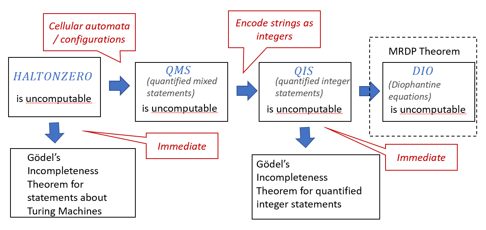

# 第十一章：所有定义皆可证否？

```admonish tip title="本章的学习目标"
* 更多与计算不那么相关的不可计算函数的例子
* 哥德尔不完备性定理（Gödel's incompleteness theorem）——一个震撼了20世纪初数学界的定理。
```

```admonish quote
> _“以任何明确的未解决问题为例取任何确定的，未被解决的问题，比如……是否存在无穷个使得$2^n+1$为质数的$n$。无论这些问题在我们面前看起来多么不可接近，我们对此感到多么无助，但我们仍然坚定地相信，它们的解决必将通过有限的纯逻辑过程而得以实现……”_
>
> _“每个数学问题可解的信念是对工作者一种强大的激励。我们内心听到永恒的召唤：这是问题。寻找它的解决方案。你可以通过纯粹的理性找到它，因为在数学中没有不可知。”_ ——大卫·希尔伯特（David Hilbert），1900年。

>_“一个陈述的意义在于它的验证方法。”_——莫里茨·施利克（Moritz Schlick），1938年（即逻辑实证主义的“验证原则”）
```

在[第九章](chapter_x.md)中提到的内容虽然自然且重要，但其在定义上仍然与程序NAND-TM或其他的计算机制密切联系。或许有人希望，只要我们避免使用以自身为输入的函数，我们就能避免“不可计算性的诅咒”。可惜，我们没这么好运。

在这一章中，我们会看到一个例子。它是一个看起来自然而且“无计算”的问题，尽管如此，它却是不可计算的：求解丢番图方程。作为一个推论，我们会看到20世纪数学界最令人震惊的结果之一——哥德尔不完备定理，它表示存在一些数学（事实上是数论）陈述**本质上无法证明**。我们将从结果开始讲，之后再讲证明。


```admonish tip title="本章的一个非数学化概览"
本章的主要结果是哥德尔的不完备性定理，该定理表明，对于每一个证明系统，存在一些关于算术的命题，它们在该系统中是正确的，但无法被证明。但是我们将更进一步地探讨**不可计算性**和**不可证明性**的关系。比如，停机问题的不可计算性立刻导致了关于图灵机的不可证明命题。为了说明哥德尔不完备性定理，我们将会定义“证明系统”的概念。我们会给出一个包含在逻辑和数学二中使用的所有具有“公理+推理规则”的系统的，非常概括性的定义。然后我们将建立机器，将计算编码为算术，这将使我们能够证明哥德尔定理。
```


```admonish pic id = "godelstructurefig"


{{pic}} 本章结果的概述。哥德尔不完备性定理的一个版本是停机问题的直接结果。为了获得像先前陈述一样的定理（关于整数的陈述），我们首先证明，确定涉及整数和字符串的量化语句的 $QMS$ 问题是不可计算的。我们通过使用**图灵机构型**的想法做到这一点，但是也有很多其他可选的方案来做到这一点。详见[备注11.14](#r11.14).
```
## 希尔伯特计划和哥德尔不完备性定理

```admonish quote
“这些……消失的增量是什么呢？它们既不是有限量，也不是无限小的量，更不是虚无。难道我们不能称它们为‘消逝量的幽灵’吗？”

————乔治·贝克莱（George Berkeley），1734
```
18世纪和19世纪是一个数学上大发现的年代，但同时也是一个出现数学危机的年代。牛顿和莱布尼茨在17世纪末发现的微积分引领了一个解决问题的黄金时代。很多长期未解决的问题屈服于新发现的工具，而数学家们在做令人实在印象深刻的计算方面做的甚至更好。然而，这些计算背后的严格基础还有很多不足之处。数学家们漫不经心地操纵无穷小量和级数，虽然大部分时候他们可以得到正确的答案，仍然存在一些怪异的例子（例如尝试计算无穷级数$1-1+1-1+1+\ldots$），根据计算方法的不同，似乎会给出不同的答案。这导致对这门学科的基础的不安感越来越大，而最终被柯西（Cauchy），魏尔斯特拉斯（Weierstrass）和黎曼（Riemann）解决。他们给了分析学一个更加坚实的基础，由此产生了至今仍然令学习高等微积分课程的学生苦苦应对的$\epsilon-\delta$语言。

在20世纪初，人们试图以更高的严谨性，将这一努力推广到数学的各个领域，希望证明所有正确的命题都可以被由一些公理出发，用推理的逻辑规则生成。这种努力被称作**希尔伯特计划**，由著名的数学家大卫·希尔伯特命名。

可惜，事实是我们看到的结果给这个计划造成了毁灭性的打击。正如哥德尔在1931年证明的那样：

```admonish quote title=""
{{thmc}}{thmc:t11.1} 哥德尔不完备性定理：非正式模式

对于任何一个可靠的且能表达足够丰富数学命题的证明系统 $V$，都存在一个数学陈述，它是**真**的，但在 $V$ 中是**不可证明的**。
```

### 定义“证明系统”{#sec11.1}

在证明[#定理11.1](t11.1)之前，我们需要定义什么是“证明系统”，甚至形式化的定义“数学陈述”的概念。在几何于其他一些数学领域，证明系统经常被定义为从一些基础的假设或者**公理**开始，然后通过使用**推理规则**导出更多的命题，例如著名的[肯定前件](https://en.wikipedia.org/wiki/Modus_ponens)，但是我们需要用什么公理？什么规则？我们将使用一个极为广泛的证明系统概念，甚至不局限于具有公理和推理规则形式的系统。


```admonish note title="备注11.14（其他可选的证明方式）"
有很多其他方式来证明$QMS$不可计算。例如，我们可以表示这样一种情况，一个一维元胞自动机是图灵完备的（[定理8.7]()）同时展现
```
