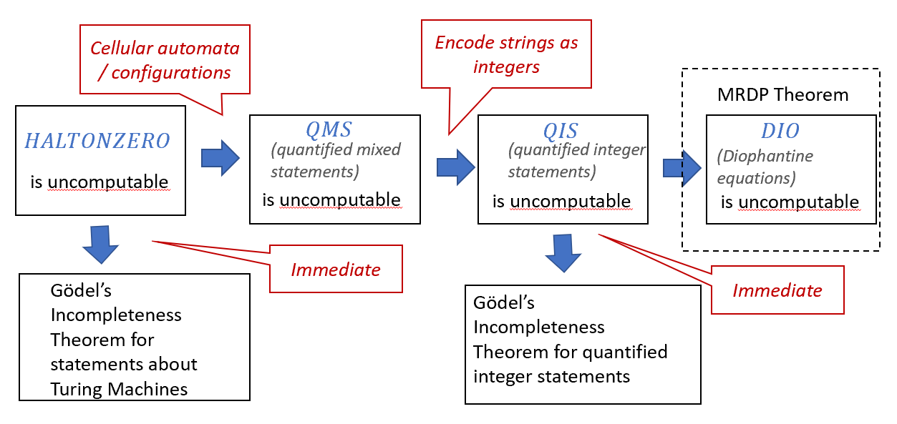

<!-- toc -->
# 11.所有定义皆可证否？ {#godelchap}

## 学习目标{ .objectives }
* 更多与计算不那么相关的不可计算函数的例子
* 哥德尔不完备性定理（Gödel's incompleteness theorem）——一个震撼了20世纪初数学界的定理。

```admonish quote
“以任何明确的未解决问题为例取任何确定的，未被解决的问题，比如……是否存在无穷个使得$2^n+1$为质数的$n$。无论这些问题在我们面前看起来多么不可接近，我们对此感到多么无助，但我们仍然坚定地相信，它们的解决必将通过有限的纯逻辑过程而得以实现……”


“每个数学问题可解的信念是对工作者一种强大的激励。我们内心听到永恒的召唤：这是问题。寻找它的解决方案。你可以通过纯粹的理性找到它，因为在数学中没有不可知。”

_-David Hilbert, 1900.
```

```admonish quote
“一个命题的意义在于它的验证方法。”（即逻辑实证主义的“验证原则”）

_-Moritz Schlick, 1938.-
```

在[第九章](chapter_9.md)中提到的内容虽然自然且重要，但其在定义上仍然与程序NAND-TM或其他的计算机制密切联系。或许有人希望，只要我们避免使用以自身为输入的函数，我们就能避免“不可计算性的诅咒”。可惜，我们没这么好运。

在这一章中，我们会看到一个例子。它是一个看起来自然而且“无计算”的问题，尽管如此，它却是不可计算的：求解丢番图方程。作为一个推论，我们会看到20世纪数学界最令人震惊的结果之一——哥德尔不完备定理，它表示存在一些数学（事实上是数论）命题**本质上无法证明**。我们将从结果开始讲，之后再讲证明。


```admonish tip title="本章的一个非数学化概览"
本章的主要结果是哥德尔的不完备性定理，该定理表明，对于每一个证明系统，存在一些关于算术的命题，它们在该系统中是正确的，但无法被证明。但是我们将更进一步地探讨**不可计算性**和**不可证明性**的关系。比如，停机问题的不可计算性立刻导致了关于图灵机的不可证明命题。为了说明哥德尔不完备性定理，我们将会定义“证明系统”的概念。我们会给出一个包含在逻辑和数学二中使用的所有具有“公理+推理规则”的系统的，非常概括性的定义。然后我们将建立机器，将计算编码为算术，这将使我们能够证明哥德尔定理。
```


```admonish pic id = "godelstructurefig"


{{pic}} 本章结果的概述。哥德尔不完备性定理的一个版本是停机问题的直接结果。为了获得像先前命题一样的定理（关于整数的命题），我们首先证明，确定涉及整数和字符串的量化语句的 $QMS$ 问题是不可计算的。我们通过使用**图灵机构型**的想法做到这一点，但是也有很多其他可选的方案来做到这一点。详见[备注11.14](#r11.14).
```
## 11.1 希尔伯特计划和哥德尔不完备性定理 { #godelproofdef}

```admonish quote
“这些……消失的增量是什么呢？它们既不是有限量，也不是无限小的量，更不是虚无。难道我们不能称它们为‘消逝量的幽灵’吗？”

_George Berkeley, 1734._
```
18世纪和19世纪是一个数学上大发现的年代，但同时也是一个出现数学危机的年代。牛顿和莱布尼茨在17世纪末发现的微积分引领了一个解决问题的黄金时代。很多长期未解决的问题屈服于新发现的工具，而数学家们在做令人实在印象深刻的计算方面做的甚至更好。然而，这些计算背后的严格基础还有很多不足之处。数学家们漫不经心地操纵无穷小量和级数，虽然大部分时候他们可以得到正确的答案，仍然存在一些怪异的例子（例如尝试计算无穷级数$1-1+1-1+1+\ldots$），根据计算方法的不同，似乎会给出不同的答案。这导致对这门学科的基础的不安感越来越大，而最终被柯西（Cauchy），魏尔斯特拉斯（Weierstrass）和黎曼（Riemann）解决。他们给了分析学一个更加坚实的基础，由此产生了至今仍然令学习高等微积分课程的学生苦苦应对的$\epsilon-\delta$语言。

在20世纪初，人们试图以更高的严谨性，将这一努力推广到数学的各个领域，希望证明所有正确的命题都可以被由一些公理出发，用推理的逻辑规则生成。这种努力被称作**希尔伯特计划**，由著名的数学家大卫·希尔伯特命名。

可惜，事实是我们看到的结果给这个计划造成了毁灭性的打击。正如哥德尔在1931年证明的那样：

```admonish quote title=""
{{thmc}}{thm:godethminformal}[哥德尔不完备性定理：非正式模式] 

对于任何一个可靠的且能表达足够丰富数学命题的证明系统 $V$，都存在一个数学命题，它是**真**的，但在 $V$ 中是**不可证明的**。
```

### 11.1.1 定义“证明系统” {#godelproofsystemssec}

在证明{{ref:thm:godethminformal}}之前，我们需要定义什么是“证明系统”，甚至形式化的定义“数学命题”的概念。在几何于其他一些数学领域，证明系统经常被定义为从一些基础的假设或者**公理**开始，然后通过使用**推理规则**导出更多的命题，例如著名的[肯定前件](https://en.wikipedia.org/wiki/Modus_ponens)，但是我们需要用什么公理？什么规则？我们将使用一个极为广泛的证明系统概念，甚至不局限于具有公理和推理规则形式的系统。

**数学命题**：在最高一层，一个数学命题只是一段文字，我们可以把它当成一个**字符串** $x \in \{0, 1\}^*$。数学命题包括一些命题，其正确性不依赖于任何经验试试，而只表示抽象概念的性质。
例如，下面是一个数学命题：^[这是一个**错的**命题]
> 数字 $2$,$696$,$635$,$869$,$504$,$783$,$333$,$238$,$805$,$675$,$613$, $588$,$278$,$597$,$832$,$162$,$617$,$892$,$474$,$670$,$798$,$113$都是质数。

数学命题不一定要含有数字。他们可以命题其他任何数学对象的性质，包括几何，字符串，函数，图，甚至**程序**。
因此，数学命题的另一个性质如下，

```python
def f(n):
    if n==1: return 1
    return f(3*n+1) if n % 2 else f(n//2)
```
**证明系统**：对一个定理$x \in \{0, 1\}^*$的**证明**也是一个字符串$w \in \{0, 1\}^*$

1. 有效性 给定一个命题$x$和一个证明$w$，存在一个算法来验证$w$是否是$x$的证明（比如一行一行的确认每一行都是由合法的推理规则从前一行推导出来的。

2. 可靠性 若对于$x$，存在一个合法的证明$w$，则$x$为真。

这些是对于一个证明系统的很少的要求。第二个要求（可靠性）正是形式系统的定义：你不应该能证明一个假的命题。第一个要求也是必要的。如果没有一组推理规则（换句话说，一个算法）来检查一个证明是否合法，那么它怎么能称之为证明系统呢？我们倒不如直接把它替换为这样一个系统：对于任何命题，证明都是“相信我，这是真的”。

形式化的，我们定义证明系统为这样一个算法$V$：$V(x, w) = 1$当且仅当$w$是$x$的一个合法证明。即使$x$为真，$w$也不一定合法（对于一个正确的命题如$2+2=4$，有很多中错误的证明方法），但是如果$w$合法，那么$x$一定为真。

```admonish quote title=""
{{defc}}{def:proofsystemsdef}[证明系统]

令$\mathcal{T}\subseteq\{0, 1\}^*$是所有正确命题的集合。
$\mathcal{T}$的一个**证明系统**是满足下列两个条件的算法$V$：
1. 有效性 对任意$x, w \in \{0, 1\}^*$，$V(x,w) = 0$。
2. 可靠性 对任意$x \notin \mathcal{T}$和$w \in \{0, 1\}^*$，$V(x,w) = 0$。

一个正确命题$x \in \mathcal{T}$是（在$V$中）**不可证明**的，如果$\forall w \in \{0, 1\}^*$，$V(x, w) = 0$。而如果在$V$中任意命题都可证明，那么我们称$V$为**完备的**。
```

```admonish bigidea
{{idec}}{ide:proofsystems}
一个**证明**就是一个字符串，它的意义是由**证明算法**赋予的。
```

## 11.1.2 哥德尔不完备定理：计算变体
我们的第一个对{{ref:thm:godethminformal}}的形式化涉及关于图灵机的陈述。
我们令 $\mathcal{H}$ 为表示这些命题的字符串的集合：图灵机$M$在输入为0的情况下不会停机。

```admonish quote title=""
{{thmc}}{thm:godethmtakeone}[哥德尔不完备定理：计算变体] 

不存在对$\mathcal {H}$完备的证明系统。
```

```admonish proof collapsible=true, title = "对{{ref:thm:godethmtakeone}}的证明思路"
假设我们有这样一个完备且可靠的，能够解决$HALTONZERO$问题的证明系统。在输入一个图灵机$M$时，我们同时在这个图灵机上输入0并运行，以及搜索所有我们需要的$w$，如果我们证明了“$M$在输入0时不会停机”则输出0。如果这个证明系统可靠而且完备，那么要么这个机器会停机，要么我们最终会找到一个证明，它会给我们一个正确的输出。
```

```admonish proof collapsible=true, title = "对{{ref:thm:godethmtakeone}}的证明"
使用反证法。
假设存在一个证明系统$V$，我们就可以用$V$来建立一个算法$A$，用以计算$HALTONZERO$问题，这和{{ref:thm:haltonzero-thm}}矛盾。
我们将这样构造这个算法$A$：

```admonish quote title=""
{{algc}}{haltingfromproog}[用证明检测是否停止]
$
  \begin{array}{l}
  \mathbf{Input:}\ 图灵机M \\
  \mathbf{Output:}\ 如果M输入0会停止则输出1，否则输出0 \\
  \hline
  \mathbf{for} \{n = 1, 2, 3, \cdots \} \\
  \quad \mathbf{for} \{w \in \{0, 1\}^n \} \\
  \quad \quad \mathbf{if}\{V(“M在输入0时不会停止”, w) = 1\} \\
  \quad \quad \quad \mathbf{return} 0\\
  \quad \quad \mathbf{endif}\\
  \quad \quad 在输入为0的情况下在M中模拟n步\\
  \quad \quad \mathbf{if} \{M停下了\}\\
  \quad \quad \quad \mathbf{return} 1
  \quad \quad \mathbf{endif}\\
  \quad \mathbf{endfor}\\
  \mathbf{endfor}
  \end{array}
$
```

如果$M$输入0时在$N$步后停止，那么根据证明系统的可靠性，不存在一个对“$M$在输入0时不停止”的证明，所以它永远不会输出0。在循环的$n = N$时，我们会对$M$模拟$N$步，然后输出1。否则，如果$M$在输入0时不会停下，那它永远不会返回1。因为系统是完备的，存在一个证明此事的$w$。所以当$A$运行到$n = |w|$的时候会找到$w$并输出0。因此，在证明系统完备且可靠的假设下，$A(M)$能解决$HALTONZERO$问题。这产生了矛盾。
```

```admonish info
{{remc}}{rem:godelstmtrem}[哥德尔命题(可选)]
人们可以从定理11.3的证明中得出一个流程来对于任意证明系统$V$生成一个为真但在$V$中不可证明的命题$x^*$。但是哥德尔的证明给出了一个$x$的很明确的描述，它接近于“说谎者悖论”。也就是说，哥德尔命题$x^*$为真当且仅当$\forall_{w \in \{0, 1\}^*} V(x, w) = 0$。
也就是说，它满足这样的性质：

$$
x^* 为真 \Leftrightarrow x^*在V中没有证明 \label{godeleq}
$$

可以看出，如果$x^*$为真，那么它没有证明。如果它是假的，那么（如果证明系统是可靠的）它不能有证明。因此，$x^*$必定为真而且不可证。
我们可能会好奇怎么可能有满足 [godeleq](){.eqref}的$x^*$，毕竟$x^*$既出现在等式左边也出现在等式右边。
要点是，对{{ref:thm:godeleq}}的证明产生了一个方法来将任意命题$x$转变成另一个命题$F(x)$，使得$F(x)$为真当且仅当$x$在$V$中不可证。
因此，$x^*$需要是$F$的一个**不动点**：一个句子使得$x^*=F(x^*)$。
事实上，[我们总能找到](https://en.wikipedia.org/wiki/Kleene%27s_recursion_theorem)这样的不动点。
我们在$\lambda$演算中已经看到了这种现象，即$Y$组合子把每个$F$映射到$F$的一个不动点$YF$。这和能打印自身的程序很像。事实上，Scott Aaronson将哥德尔命题表述成如下说法：
> 以下句子重复两次，第二次用引号表示，在形式系统 V 中无法证明。“以下句子重复两次，第二次用引号表示，在形式系统 V 中无法证明。”

在上述论证中，我们实际上表示了$x^*$为真，如果$V$可靠的话。

由于$x^*$为真而且在$V$中没有证明，这意味着我们无法在系统 V 中使用上述论证。所以$V$不能证明其自身的可靠性（或者甚至是一致性：一个命题和其否命题不同时为真）。通过这个想法，不难得出哥德尔第二不完备订立，即每个相对复杂的$V$无法证明其自身的一致性。也就是说，如果我们形式化的写出一个命题$c^*$，它成立当且仅当$V$是一致的（也就是说，$V$不能同时证明一个命题以及它的否命题），那么$c^*$在$V$中不可证明。
```

```admonish note title="备注11.14（其他可选的证明方式）"
有很多其他方式来证明$QMS$不可计算。例如，我们可以表示这样一种情况，一个一维元胞自动机是图灵完备的（[定理8.7]()）同时展现
```
