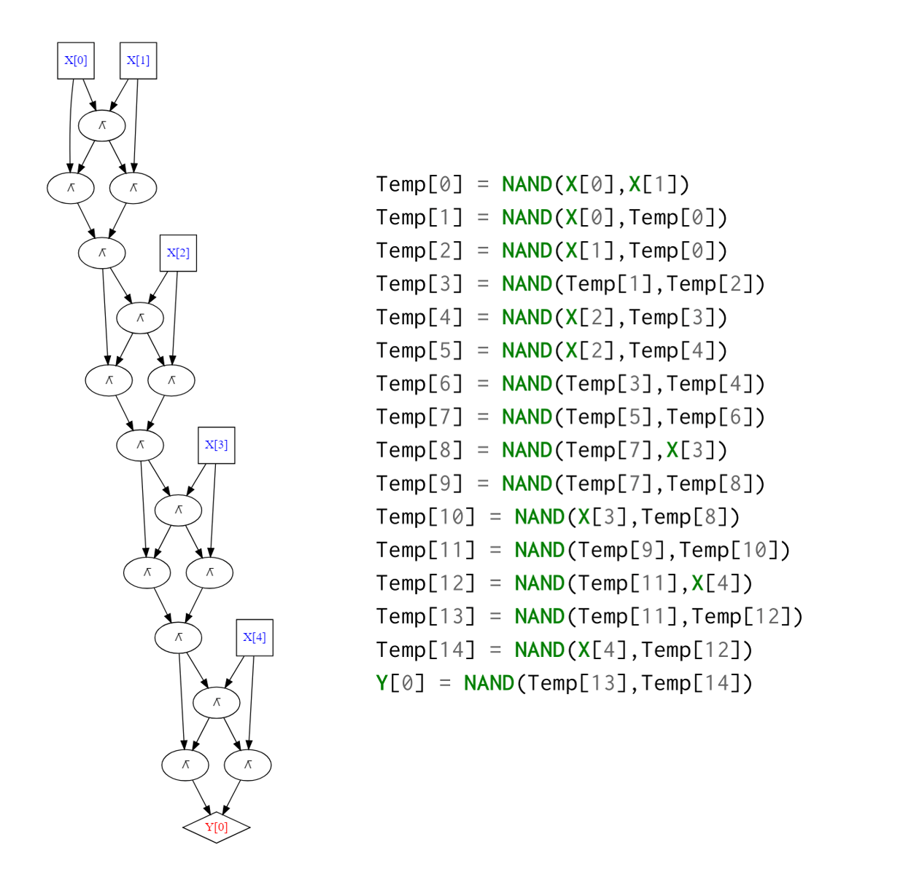

# 无限域函数，自动机与正则表达式

> [!tip] 本章的学习目标
> * 在*长度无界*的输入上定义函数，这种函数无法用一个由输入和输出构成的有限大小的表格描述
> * （前者）与语言的成员资格判定任务的等价性*
> * 确定性有穷自动机（可选）：一个无界计算模型的简单案例
> * （前者）与正则表达式的等价性

> [!QUOTE] 
> “算法以有限回答无穷”
> 
> *—Stephen Kleene*

布尔电路的模型（或者说，NAND-CIRC编程语言）有一个非常明显的短板: 一个布尔电路只能计算一个*有限的*函数$f$。事实上，由于每个门配有两个输入，大小为$s$的电路至多能计算长度为$2s$的输入。

因此这一模型无法捕捉到算法作为对潜在的无穷函数进行的*统一处理*这一直观概念。

比方说，标准的小学乘法算法是一种可以对所有长度的数进行乘法运算的*统一*算法。然而，我们无法将这种算法表达为单一的电路，而是需要对每种输入配备一个不同的电路（或者说，NAND-CIRC语言）。（见图6.1）

>**图6.1 小学乘法**：
>
>你一旦知道如何计算多位数乘法。你就可以对所有$n$位数这么做，但如果你想用布尔电路或者NAND-CIRC程序来描述乘法，对所有长度为$n$的输入，你都需要一个不同的程序/电路

本章中，我们拓展了计算任务的定义，使其考虑配备*无界*定义域$\{0,1\}^*$的函数。
我们的重点在于定义计算**哪些**任务，将**如何**计算的绝大部分留给之后的章节。在其中，我们将会认识到*图灵机*与其他在无界输入上进行计算的计算模型。
然而，我们将认识到一个简单且受限的计算模型的样例——确定性有穷自动机(DFAs)。

>[!tip] 对本章内容进行的非数学化的概括：
> 本章中，我们将会讨论接受任意长度字符串作为输入的函数。
> 我们将主要关注*布尔*函数这种特例，其输出为单一的位。
> 除此之外仍然有无数多个输入长度无界的函数。因此这一的函数不能被任何一个单一的布尔电路计算。
> 在这本书的第二部分，我们会讨论*有穷自动机*，这种计算模型可以计算一个输入长度无界的函数。
> 确定性有穷自动机不像Python或其他通用编程语言一样强大。但它可以作为这些更加通用的计算模型的一个引子。
> 我们将会展示一个美妙的结果——能被有穷自动机计算的函数与能被*正则表达式*计算的函数精确地一致。
> 然而，读者仍然可以自由跳过自动机的部分而直接转向[第七章](./chapter_7.md)中对于*图灵机*的讨论。

## 输入长度无界的函数

直到现在，我们考虑的计算任务都将某些长度为$n$的字符串映射为某个长度为$m$的字符串

然而，一般情况下的计算任务都会涉及到长度无界的输入
例如，接下来的Python函数会计算一个函数$XOR:\{0,1\}^* \rightarrow \{0,1\}$, 其中 $XOR(x)$ 为 $1$ 当且仅当$x$中$1$的数量为奇数.

（换言之，对每个 $x\in \{0,1\}^*$，$XOR(x) = \sum_{i=0}^{|x|-1} x_i \mod 2$）
$XOR$虽然简单，却无法被一个布尔电路计算
然而，对每个$n$，我们都能通过一定不同的电路计算$XOR_n$($XOR$函数在$\{0,1\}^n$的限制)(e.g. 见图6.2). 


```python
def XOR(X):
    '''接受一个0与1的列表X
       当1的个数为奇数时输出1
       否则输出0'''
    result = 0
    for i in range(len(X)):
        result = (result + X[i]) % 2
    return result
```

>**图 6.2**：
>
>计算$5$位异或的NAND电路与NAND-CIRC程序。值得注意的是$XOR_5$的电路仅仅只是重复了四次计算$2$位异或的电路。
在这本书的前面部分，我们研究了*有限*函数$f:\{0,1\}^n \rightarrow \{0,1\}^m$的计算。这样一种函数$f$总是能通过列举所有的输入$x\in \{0,1\}^n$所对应的$2^n$个函数值来表示
本章中，我们考虑像$XOR$这样输入长度无界的函数
尽管我们能有有限多个符号来描述$XOR$（事实上，我们在上面已经做过了），它却能接受无穷多种可能的输入，因此我们无法把它所有的函数值都写下来
这对其他蕴含着其他重要计算任务的函数也是同理，包括加法，乘法，排序，在图上寻找路径，由点拟合曲线，等等。

为了和有限情况作区分，我们有时将称函数$F:\{0,1\}^* \rightarrow \{0,1\}$（或$F:\{0,1\}^* \rightarrow \{0,1\}^*$）*无限*
然而，这不意味着$F$可以接收一个无限长的输入。
它仅仅表面$F$可以接收任意长的输入，因此我们无法简单地把在一个表上把不同输入下$F$的全部输出都写下来

> **想法6.1**
> 函数$F:\{0,1\}^* \rightarrow \{0,1\}^*$指明了一个将输入$x\in \{0,1\}^*$映射到$F(x)$的计算任务. 

As we have seen before, restricting attention to functions that use binary strings as inputs and outputs does not detract from our generality, since other objects, including numbers, lists, matrices, images, videos, and more, can be encoded as binary strings.

就像我们先前所见的那样，将我们的注意力限制在以二进制串为输入和输出的函数上是不失一般性的、因为其他的对象，像数字，列表，矩阵，照片，视频，以及别的种种，都可以用二进制串编码

As before, it is essential to differentiate between _specification_ and _implementation_. For example, consider the following function:

如前所述，我们有必要区分*规范*和*实现*。例如，考虑以下函数

$$
TWINP(x) = \begin{cases} 
       1 & \exists_{p \in \N} \text{使得} p,p+2 \text{为质数且} p>|x| \\
       0 & \text{否则}     
       \end{cases}
$$

在数学上，这是一个良定义的函数。对每个$x$,$TWINP$都会有一个非$0$即$1$的函数值。然而，截至目前，尚未已知能计算该函数的Python程序。[孪生素数猜想](https://en.wikipedia.org/wiki/Twin_prime)主张对每个$n$都有一个$p>n$使得$p,p+2$均为素数。
如果该猜想成立，那么$T$（译者注:此处应指$TWINP$）是很容易计算的—— `def T(x): return 1`是奏效的
然而，自1849年起，数学家们对该猜想的证明均无功而返。
这说明，不论我们知不知道$TWINP$函数的*实现*，上面的定义提供的都是它的*规范*

### 改变输入和输出

许多让我们感兴趣的函数都接受不止一个输入，例如函数：

$$
MULT(x,y) = x \cdot y
$$

接受一个二进制表示的整数对$x,y \in \N$，并输出积$x \cdot y$的二进制表示.
However, since we can represent a pair of strings as a single string, we will consider functions such as MULT as mapping $\{0,1\}^*$ to $\{0,1\}^*$.
然而，因为我们能够将一对字符串表达为一个单一的字符串，我们将把像MULT这样的函数视为从$\{0,1\}^*$到$\{0,1\}^*$的映射。
我们一般不考虑像把一对整数精确地表达为串的方式这样的底层细节，因为近乎所有的选择对我们的目标而言都是等价的。

我们想计算的另一个函数是

$$
PALINDROME(x) = \begin{cases}
        1 & \forall_{i \in [|x|]} x_i = x_{|x|-i} \\
        0 & \text{否则}
        \end{cases}
$$

$PALINDROME$ 以一个单一的位作为输出。以一个单一的位为输出的函数成为*布尔函数*。
布尔函数是计算理论的中心，因此我们将在这本书中经常性地讨论它。
需要注意的是，即使布尔函数只有一个单一位用于输出，其输入可以是任意长度的。
因此它们仍然无法通过一个由函数值组成的有限表格描述，仍然是一个无限函数。

*“布尔化”函数*。有时从一个非布尔函数中构造一个布尔函数的变体是非常方便的。
例如，下列函数是$MULT$的一个布尔函数变体：

$$
BMULT(x,y,i) = \begin{cases}
                x\cdot y \text{的第i位} & i <|x \cdot y| \\
                0     & \text{否则}
               \end{cases}
$$

如果我们能够通过例如Python，C，JAVA等任何一门编程语言计算$BMULT$，我们也可以计算$MUL$，反之亦然。